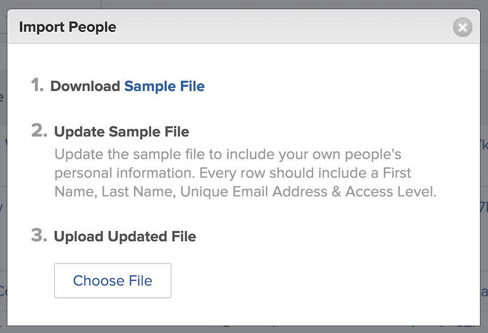
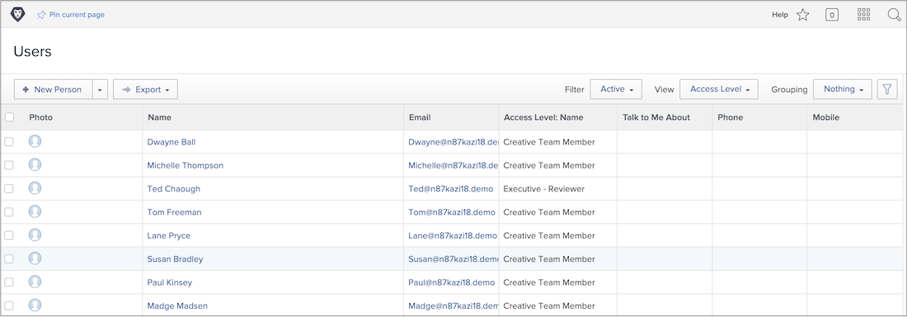

# Add users in bulk

Adding users one at a time can be time consuming and overwhelming. [!DNL Workfront] allows a system administrator to add multiple users at the same time using the import feature.

![[!UICONTROL Import People] menu option](assets/admin-fund-adding-users-5.png)

1. Select **[!UICONTROL Users]** from the [!UICONTROL Main Menu].
1. Select the arrow on the **[!UICONTROL New Person]** button and select **[!UICONTROL Import People]**.
1. The window that opens walks you through creating a spreadsheet of the users to import.
1. Download the sample file, which is an [!DNL Excel] spreadsheet.
1. Update the spreadsheet with user information — first name, last name, email address, access level — following the instructions in the file itself.
1. Select the **[!UICONTROL Choose File]** button once the user list is saved.
1. Navigate to the user spreadsheet file and select it.

The imported users appear in the [!UICONTROL Users] list. Edit the information on individual or multiple users, if needed.

## Import users: Using kick-starts

[!DNL Workfront] provides a kick-start template to import data into the system. It can also be used for importing users. Before you use the kick-start, [!DNL Workfront] recommends you work with your [!DNL Workfront] consultant, as there are considerations you should be aware of.

<!--
paragraph below needs URL to article
-->

See Import Data into Workfront via Kick-Starts for detailed information.

![[!UICONTROL Import Data] ([!UICONTROL Kick-Starts]) window in [!UICONTROL Setup] area](assets/admin-fund-adding-users-8.png)

<!--
Learn more URLs
Import users
Import data into Workfront via Kick-Starts
-->
