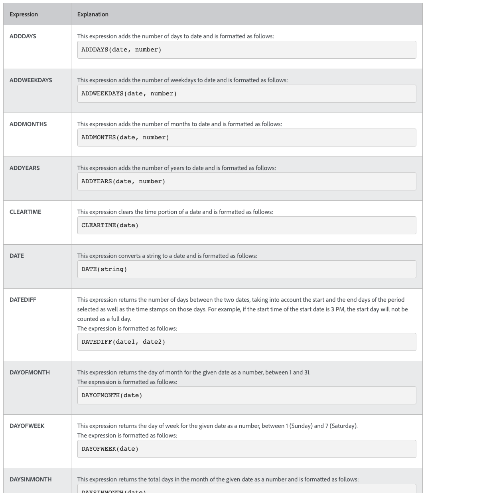

# Understand Date & Time and Mathematical expressions

## Date & Time expressions

Date and time expressions let you pull important dates to the forefront of your reports, automatically calculate the number of work days it took to complete a task, or remove timestamps from view when they aren’t needed.

When looking at the available date and time expressions, you’ll find several options available.

There are two date and time expression sets used most often by [!DNL Workfront] customers:

* ADDDAYS/ADDWEEKDAY/ADDMONTHS/ADDYEARS and 
* DATEDIFF / WEEKDAYDIFF

## Mathematical expressions

Mathematical expressions allow [!DNL Workfront] to automatically do calculations, whether simple or complicated.

When looking at the available date and time expressions, you’ll find that you have several options available.

[!DNL Workfront] customers commonly use these two mathematical expression sets:

* SUB, SUM, DIV, PROD
* ROUND
