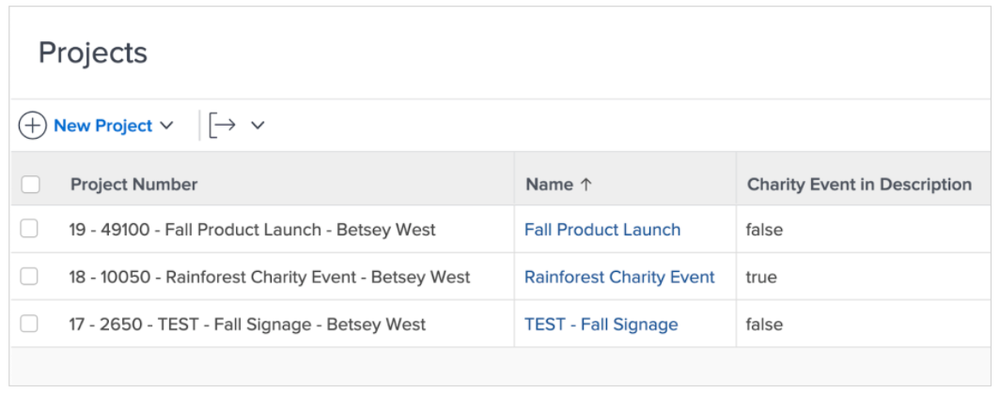

# Use the ISBLANK and CONTAINS expressions

Both the CONTAINS and ISBLANK expressions are used to provide simple true or false values. The difference is the ISBLANK expression checks if the field holds a value at all while the CONTAINS text expression looks for a specific string within a field.

For example, to see if a project has a description, use the ISBLANK expression. If the description field is blank, the expression returns a value of true. If the description field is not blank, it returns a value of false.

To look for a specific value in the description, like “charity event,” use the CONTAINS text expression. If it finds “charity event” in the description, the calculated field says “true.” It displays “false” if it doesn’t find “charity event.”.

## ISBLANK

The ISBLANK text expression includes the name of the expression and one data point. 

**ISBLANK({data point})**

In the example above—where you want to know if the project has a description—the expression would be:

ISBLANK({description})

## CONTAINS

The CONTAINS text expression includes the name of the expression, the word or phrase you’re looking for, and the field to look in. 

**CONTAINS(“phrase”,{fields})**

Make sure to put quotes around the word or phrase you’re looking for, otherwise the expression won’t be valid.

In the example above (looking for “charity event” in the project description), the expression would be:

**CONTAINS(“charity event”,{description})**

**Note**: The CONTAINS expression is case sensitive. For example, if “Charity Event” is capitalized in the description field, capitalize that phrase in the expression.

**CONTAINS(“Charity Event”,{description})**

Both the ISBLANK and CONTAINS expressions are good to use if you’re looking to see if a value is present. However, it may be more useful to know what the value is, to actually see it or have some sort of descriptor to provide better insight.

For example, instead of just knowing that a project has been converted from a request, you want to know the name of the original request. 

In that case, use the CONTAINS expression in conjunction with an IF expression. 

More often than not, the ISBLANK and CONTAINS text expressions are used with an IF text expression.
