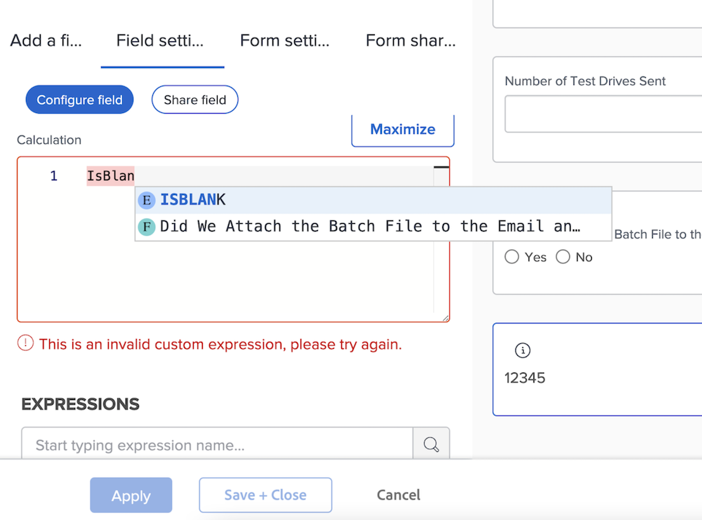
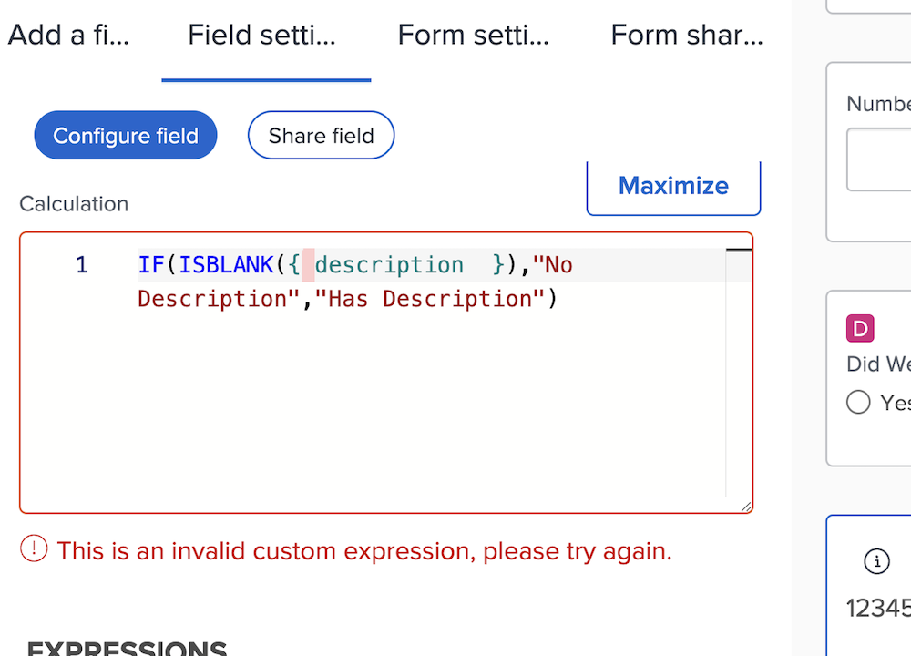
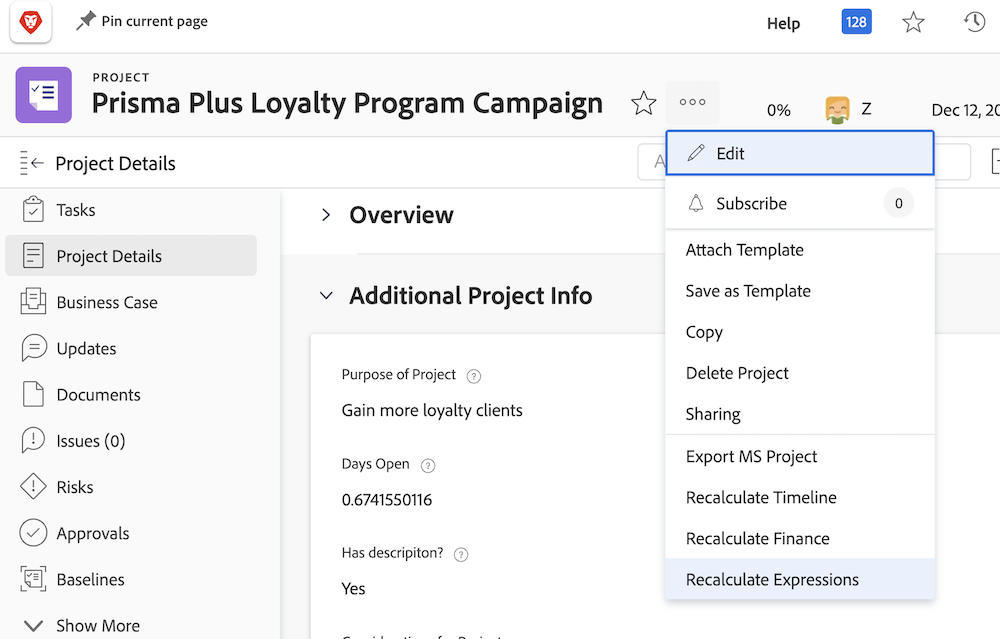
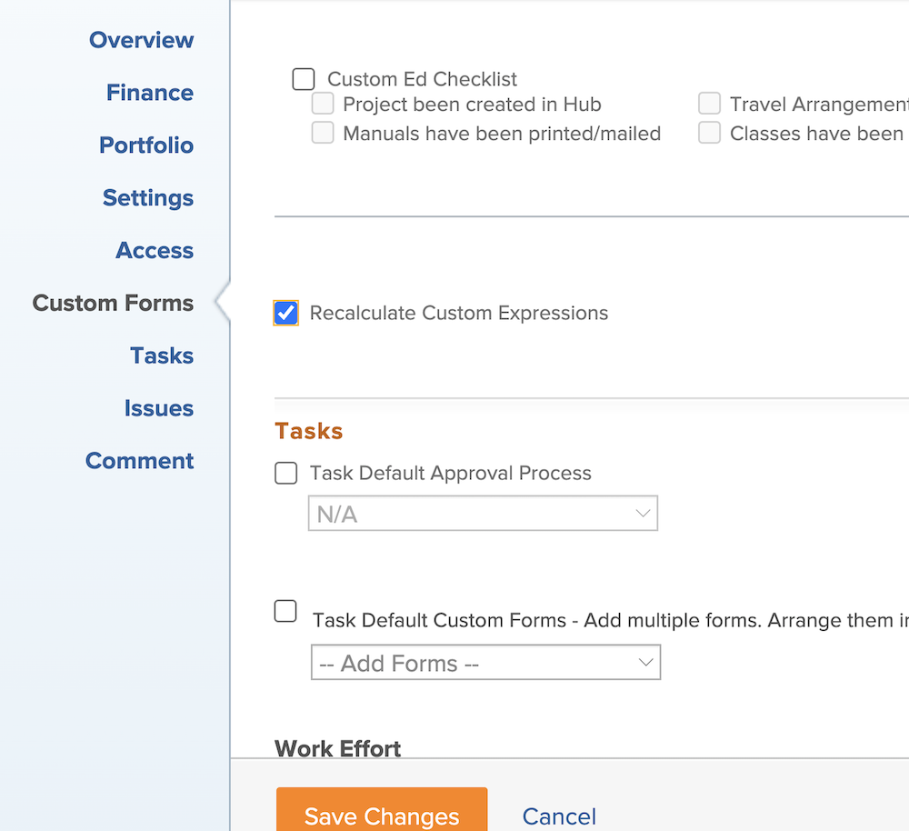

# Things to know about calculated field expressions

Here is a list of concepts that are good to know when working with custom calculated fields in Workfront.

## Casing matters in expression names

When it comes to expression names, casing matters. When initially writing an expression name you can use upper case, lower case, or a mix of both. 

However, the expression must be written as all upper-case letters for the system to recognize the expression and save the field. 

 

## Hours are stored in minutes

Hours in Workfront's database are stored in minutes. If you're referencing fields like Planned Hours or Actual Hours, divide by 60 to show the time in hours and not minutes. 

## Spacing doesn't affect expressions

The recommended way to write expressions is with little to no spacing between each expression. 

* IF(ISBLANK({description}),"No Description","Has Description") 

However, if spacing helps you see what is going on, some spacing can be added to the expressions. The extra spaces shouldn't prevent the expression from gathering or calculating a value in [!DNL Workfront]. 

* IF (ISBLANK ({description}), "No Description" , "Has Description" ) 

The only things that cannot have spaces between them are the fields and the curly brackets. Otherwise, you will receive an error message and be unable to save the field or the custom form. 

## Quotation marks must be straight

When using quotation marks in an expression, make sure the quotation marks are straight ("). If the quotation marks are curved (") the [!DNL Workfront] system will continue to display a "Custom Expression Invalid" message.

## Calculations update on form save and object edit

This is an important aspect of calculated fields to understand.

Information displayed in a calculated field will remain the same and become stale unless the custom form is recalculated. 

Expressions can be refreshed by using the Recalculate Expressions option in the More menu on an object.

You want to see the number of days an issue has been open. Create a calculated field called "Days Open" with the expression DATEDIFF.

* Field Name = Days Open
* Expression = DATEDIFF({entryDate},$$TODAY)
 
Once saved, the number of days between when the issue was first created, or entered in Workfront, and today's date can be shown on the details page of an object or in a report view. 

When viewing the same details page or report view the following day, you expect that number to increment by one. If the number is 5 today, it should be 6 tomorrow. The next day should be 7, then 8, etc. 

However, the field will continue to show 5 every day. The field has to be "re-run," or recalculated to refresh the information.

To update a field using the Recalculate Expressions option:

* Click the name of the object to open it.
* Click the More menu.
* Select Recalculate Expressions from the list.

 
You can also recalculate multiple expressions at the same time by using the "bulk edit" feature in a list or report. Suppose you created a report showing a list of issues with the Days Open calculation appearing in a column. If you want to recalculate all the issues at once:

* Select all issues in the report.
* Select the edit option to bulk edit all the selected issues.
* Click on the Custom Forms label on the left to scroll down to the custom forms section.
* Check the Recalculate Custom Expressions box at the bottom of the Custom Forms section.
* Click Save Changes.

 
The screen refreshes to show updated information in the calculated field.

**Note**: Although there are other ways of updating, or recalculating, expressions in a calculated field, this is the fastest and easiest way.

## Calculations can vary from form to form within the same field

As soon as a calculated field is saved on a custom form, and the custom form is saved, the calculated field is added to the Field Library so it can be used on other custom forms. 

However, if you have a calculated field on form A and the same calculated field on form B, the initial thought is that the calculations are exactly the same. That is not always the case. The calculated field on form A could be calculating an entirely different way on form B. 

When a calculated custom field is selected from the field library and added to a custom form, the field is added but the calculation is blank. One reason this happens is that the calculation may be referring to fields that don't exist for another object type.

For example, you've created a calculated field, "Days to Complete," to determine how long it took to complete a task in a project. 

*  WEEKDAYDIFF({actualStartDate},{actualCompletionDate})

You want to do the same thing for an iteration. You can use the same expression; however, the fields available for a task object are not always available for an iteration object. So [!DNL Workfront] gives you the chance to build the calculation with the correct object fields.

**Pro-Tip**: Copy the calculated expression from the Calculation box to the Instructions field when creating custom fields. This field is not erased when a calculated custom field is added to the custom form from the Field Library. 

Depending on the need, calculated fields in custom forms can be quite simple or very complex. Expressions can embed, or nest, other expressions and values to provide the level of detail needed to get a better picture of what is going on with the work being done at your organization. 

<!--Depending on the need, calculated fields in custom forms can be quite simple or very complex. Expressions can embed, or nest, other expressions and values to provide the level of detail needed to get a better picture of what is going on with the work being done at your organization. 

Most of the examples and exercises in this course have been relatively simple to provide a base understanding of the expressions most commonly used and how to build those expressions in a custom calculated field. 

Now you're ready to start building your own calculated custom fields.-->
