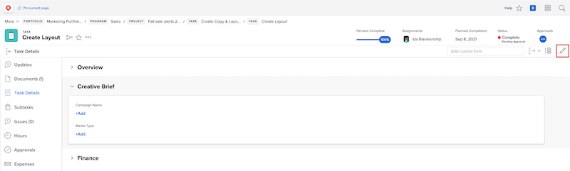

# Edit a custom form

<!--
21.4 updates have been made here
-->

You can edit information on a custom form after the form is attached to an object. 

1. Navigate to the object for which you want to edit information on the custom form. 
1. Click [Object type] **[!UICONTROL Details]** in the left panel. 
1. Expand the custom form by clicking the arrow next to its name. 
1. Click a single field in the custom form to go into edit mode on that field. You can also click the [!UICONTROL Edit] icon in the upper-right corner to edit all custom forms or edit sections of the custom forms. 
1. Type information in a single custom field, even if required fields in other custom forms on the object are not yet filled out. 
1. Click **[!UICONTROL Save Changes]**.

