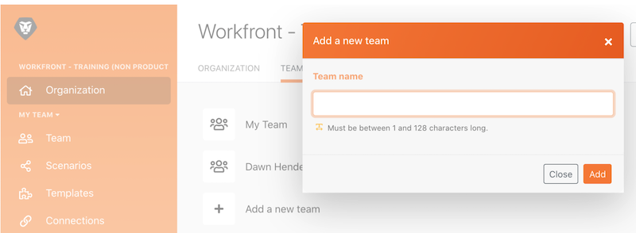

# Administration walkthrough

Learn to switch between different organizations or teams and add users to the system.

## Administration walkthrough

In this video you will learn:

* How to navigate between organizations and teams
* How to create teams
* How to invite users to an organization and a team

>[!VIDEO](https://video.tv.adobe.com/v/335310/?quality=12&learn=on&enablevpops=1)

>[!NOTE]
>
>If your organization has been onboarded to the Adobe Admin Console, see [Add users to Adobe Workfront Fusion through the Adobe Admin Console](https://experienceleague.adobe.com/docs/workfront/using/adobe-workfront-fusion/fusion-in-experience-cloud/add-fusion-users-admin-console.html).

## Want to learn more? We recommend the following:

[Workfront Fusion documentation](https://experienceleague.adobe.com/en/docs/workfront-fusion/using/get-started-with-fusion/understand-workfront-fusion/workfront-fusion-overview)
