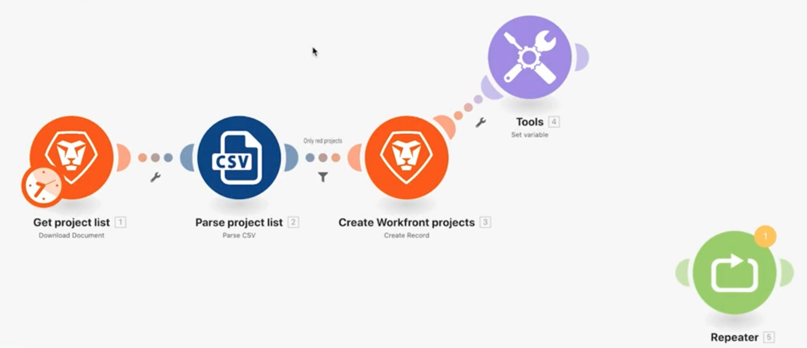
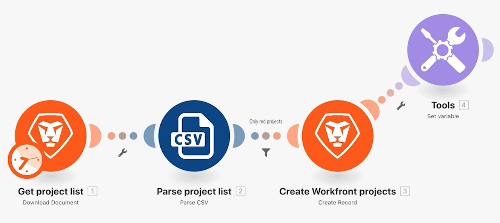
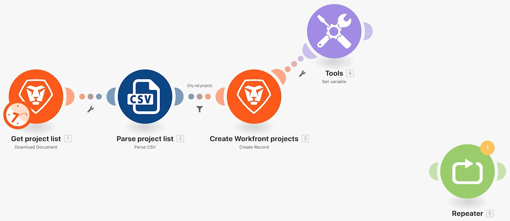
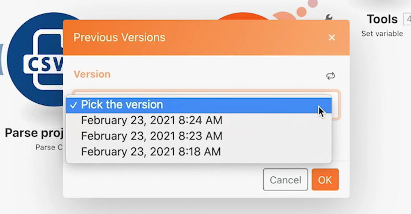

# Access previous versions exercise

Learn how to return to a previous version of a scenario.

## Exercise overview

Discover how you can restore previous versions after you've made changes to a scenario and saved it multiple times.

   

## Steps to follow

1. Clone your Using the mighty filter scenario and name it "Accessing previous versions."
1. Add a Set variable module after the Create Workfront projects module. Name the variable "Test."
1. Drag it to a new position and save the scenario.

   

1. Add a Repeater module, unlink it from the previous module, and save the scenario again.

   

1. Now delete all of your modules and save.
1. In the toolbar, click the three-dot menu and click the Previous Versions option. The picklist shows the date and time stamps for each version saved.

   

1. Choose a previous version and notice how the scenario in the designer returns to where you saved.
