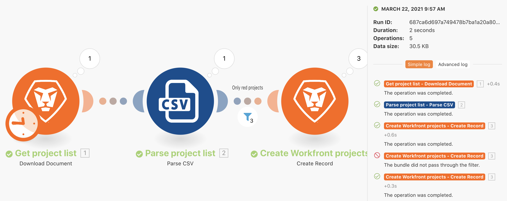
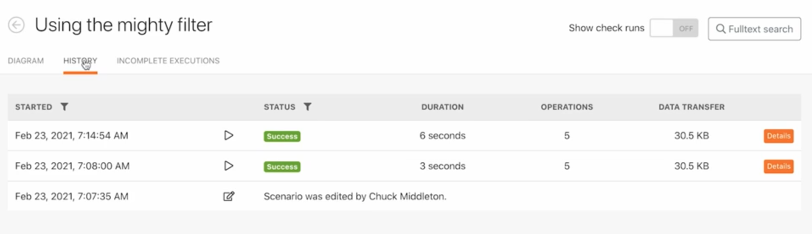
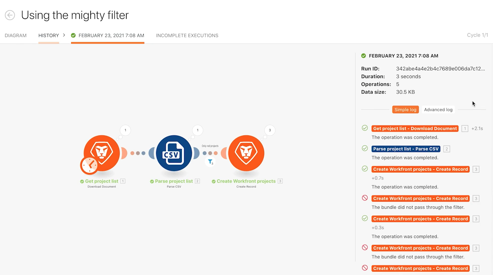
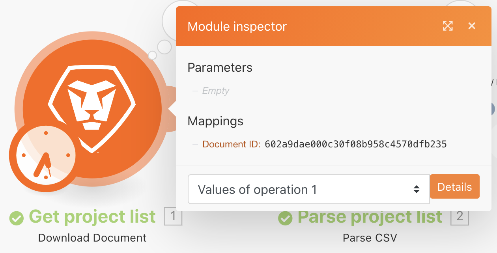
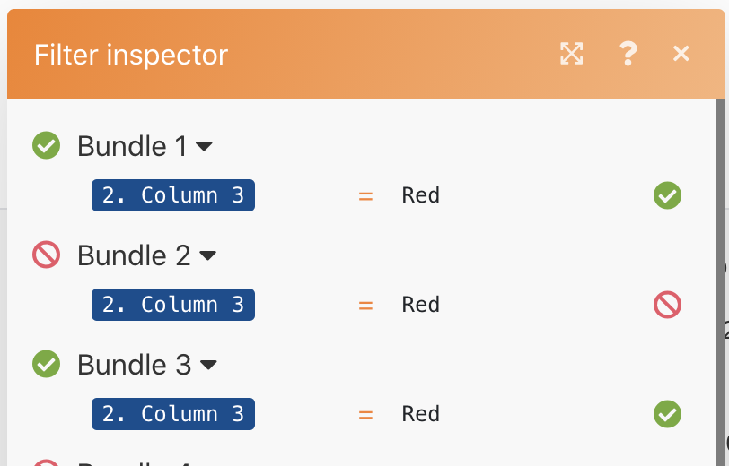
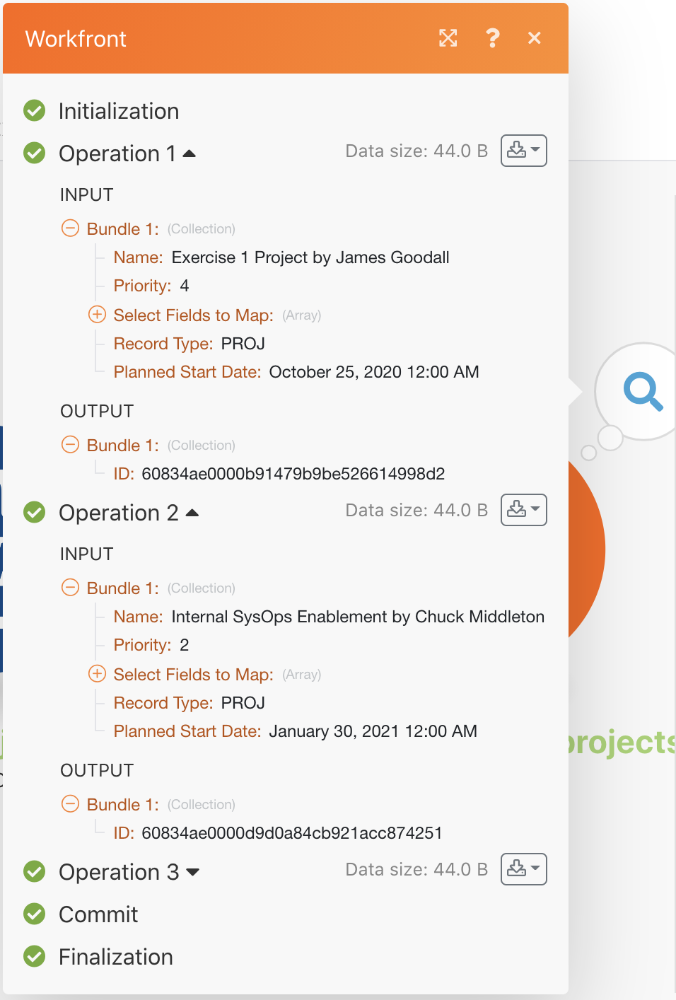
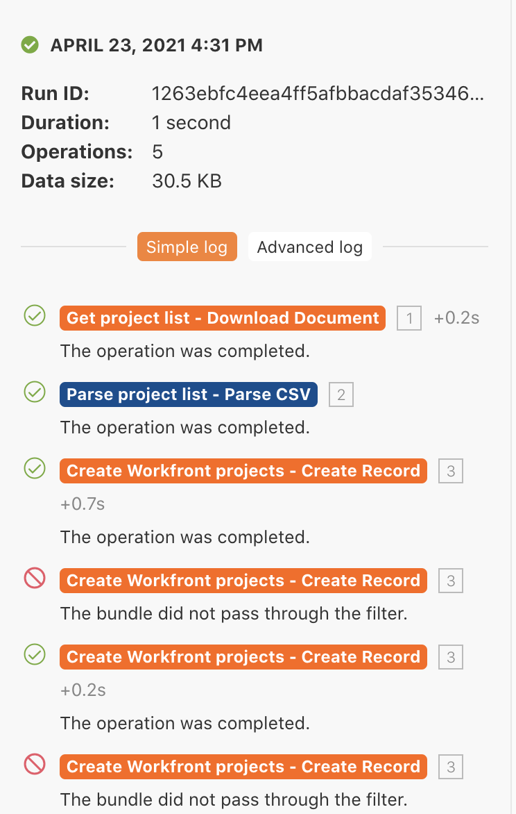
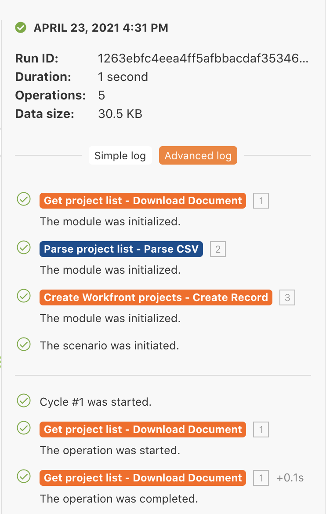

# Execution history exercise

Review and audit details about past executions and scenario configurations.

## Exercise overview

Review the execution history for the "Using the mighty filter" scenario to understand what happened when executions occurred and how they were structured when they were run.

   

## Steps to follow

1. Open your "Using the might filter" scenario.
1. From the overview page, click the History tab (at the top, under the scenario name).

   

1. Find an execution and click the details button to open a page that shows the specific operations performed (or not performed) in the right panel. In the left panel, you can examine the scenario as it was at the time of execution.

   

1. When you click a module in the scenario panel, a module inspector panel appears, displaying information on the settings of the module. Click on the execution inspector next to a module or filter to see which bundles of information were executed on.

   

   

1. In the right panel, scroll through or click through the Simple log to view details of the execution's "play-by-play."

   + You can see when operations were completed in modules and when bundles passed (or did not pass) through filters.

   
   
   + Click a log item to open the operation panel in the scenario panel. The logs are listed in chronological order of when they occurred.

   

1. The Advanced log shows similar information. However, it provides more information on how many cycles were executed per run and lets you dig deeper into which bundles of information were processed in each cycle.

