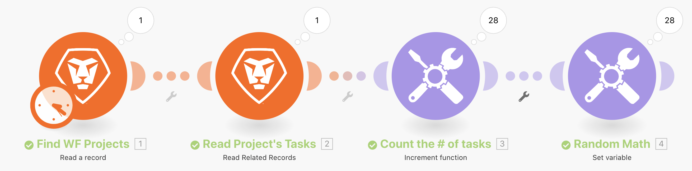
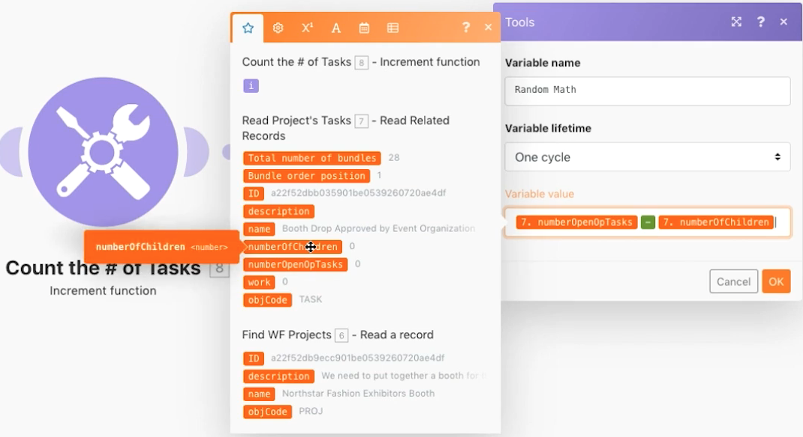

# Introduction to iterators exercise

Learn to use iteration-type apps and perform actions on each bundle of information.

## Exercise overview

Look at a specific project in Workfront, then look at all the tasks within that project. You will use the increment tool module to count the number of tasks within the project. Finally, you'll use the Set variable module to subtract the Number of Children from the Number of Open Issues to produce a numeric value for each of the task bundles.

   

## Steps to follow

   **Read a project and related tasks.**

1. Start a new scenario. Name it "Introduction to iteration."
1. Choose Workfront as the trigger module, Read a record.
1. For Record Type, choose Project.
1. For Outputs, choose ID, Name, and Description.
1. In the ID field, put the project ID of the Northstar Fashion Exhibitors Booth project from your Workfront test drive instance.
1. Rename this module "Find WF Projects."
1. Add another Workfront module to read the tasks related to this project. Choose the Read Related Records module.
1. For Record Type, choose Project.
1. For the Parent Record ID, choose the ID from the Read a record module.
1. For Collections, select Tasks.
1. For Outputs, select ID, Name, Description, Number of Children, Number of Open Issues, and Work.
1. Rename this module "Read Project's Tasks."
1. Save the scenario, then click Run once to see the outputs.

   + Click on the execution inspector and you see one bundle as input (the project) and 28 bundles as output (the tasks).

   **Count and process iterated bundles.**

1. Add another module after Read Related Records. Choose an Increment function tools module.

   + Leave the Reset a value field as Never and click OK.

1. Rename this module "Count the # of tasks."
1. Add a Set variable module. Set the Variable name to "Random Math."
1. In the Variable value field, subtract the number of open children from the number of open opTasks.

   **It should look like this:**

   

1. Rename this module "Random Math."
1. Save the scenario and click Run once.

For each of the tasks produced by the Read Related Records iterator module, Workfront Fusion performed 28 executions. These 28 bundles will continue to be processed throughout the scenario unless an aggregator is added to close the loop.
