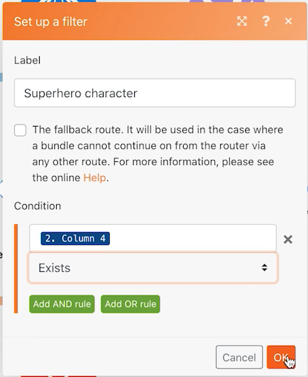

# Routers

Understand the importance of routers and how they can be used to conditionally process different modules.

## Exercise overview

Use a router to pass Pokemon vs. superheroes bundles down the correct path, then create a task for each character.

   

## Steps to follow

1. Clone the Using universal connectors scenario from the previous exercise. Name it "Creating different paths using routers."

    **Create a new path for superheroes by cloning modules and adding a router.**

   

1. Right-click the Get Pokemon info module and choose Clone. Once cloned, drag and connect it to the line between the new HTTP module and the Parse CSV module.

    >[!NOTE]
    >
    > Notice how it automatically adds a router with two paths.

1. Name this module "Get superhero appearance."
1. Clone this module, move the clone to the right, and name it "Get superhero abilities."
1. Clone the Tools module and move it to the end of the second path.
1. Click the wand icon - the Auto-align button - in the toolbar.

   **Your scenario should look like this:**

   

   **Next, you're going to change the mapped values in the new cloned modules.**

1. Go to <https://www.superheroapi.com/> and use your Facebook account to get an access token.

    >[!NOTE]
    >
    >If you have trouble accessing your own superhero token, you can use this shared token: 10110256647253588. Please be considerate of how many times you call to the superhero API so this shared token continues to work for everyone.

1. Open the settings for the Get superhero appearance and change the URL to https://www.superheroapi.com/api/[access- token]/332/appearance. Be sure to include your access token in the URL. Click OK.
1. Open the settings for the Get superhero abilities and change the URL to https://www.superheroapi.com/api/[access- token]/332/powerstats. Be sure to include your access token in the URL. Click OK.
1. Right-click each superhero module and select Run this module only. This will generate the data structure you need to see for mapping.
1. After you run both, change the number "332" in each URL field to Column 4 mapped from the Parse CSV module.

   

    **Now you can click into the Set multiple variables module in the superhero path and update the name, height, weight, and abilities.**

1. Update the Name and Abilities fields from the Get superhero abilities module--Module 8.

   

1. Update the Height and Weight fields from the Get superhero appearance module--Module 6.

   

    **When you're done, your variables should look like this. Note that the module numbers appear in the field values.**

   

1. Click OK, then save your scenario.

    **Create another path to create a task per character.**

1. In Workfront, create an empty project. Name it "Shipping Manifest Project" and copy the project ID from the URL.
1. Return to Workfront Fusion and click in the center of the router to create another path.

   

1. Click in the center of the empty module that appears and add a Create record module from the Workfront app.
1. Set the Record Type to Task and select Project ID from the Fields to Map section.
1. Paste the project ID you copied from Workfront into the Project ID field.
1. Now, select the Name field from the Fields to Map section.
1. Name the task "[Character] from [Franchise]," taking the character name and the franchise name from the CSV file. Column 3 is the character name and column 2 is the name of the franchise.

   

1. Click OK, and rename this module to "Create a task for each character."

   **Add filters so the scenario can run without errors. You want only Pokemon characters to go down the top path, only superhero characters to go down the middle path, and all characters to go down the bottom path.**

1. Click the dotted line to the left of the Get Pokemon info module to create the first filter. Name it "Pokemon character."
1. For the condition, only allow records where the franchise (Column 2) is equal to "Pokemon." Choose the text "Equal to" operator.
1. Click the dotted line on the left of the Get superhero appearance module to create the next filter. Name it "Superhero character."
1. Because superheroes can come from various franchises, use the Superhero ID field (Column 4) to determine if a character is a superhero or not.

    **Your filters should look like this:**

   

   

1. Save the scenario and click Run once. Use the execution inspectors to verify all operations were successful, and check tasks that were created in your Workfront project.

   
