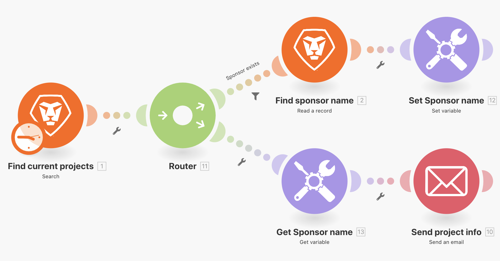
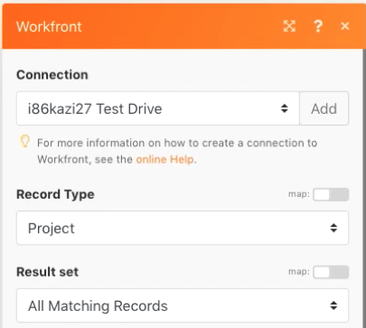
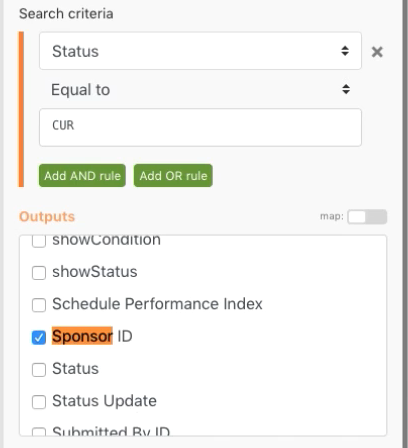
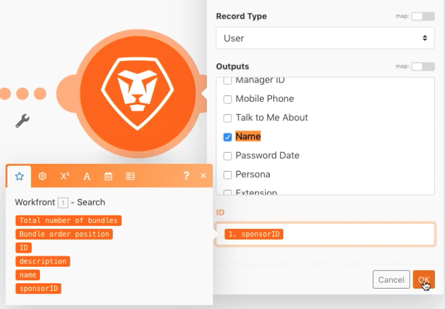
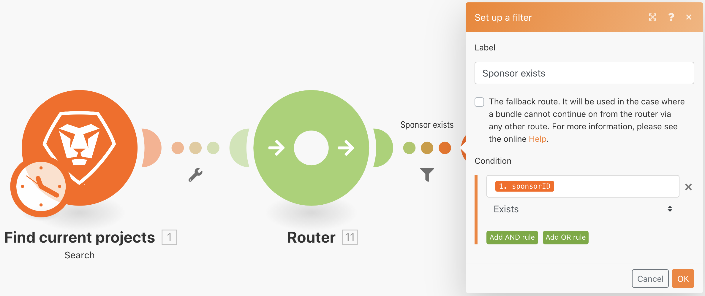
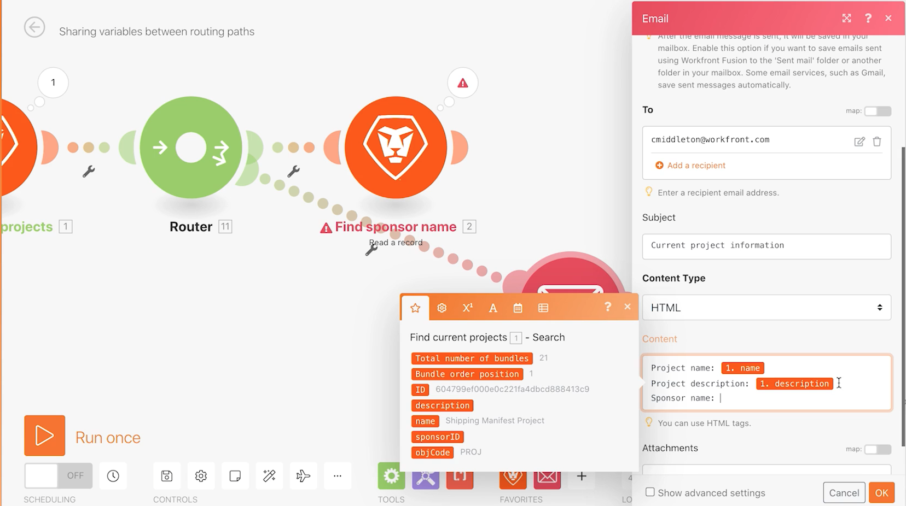
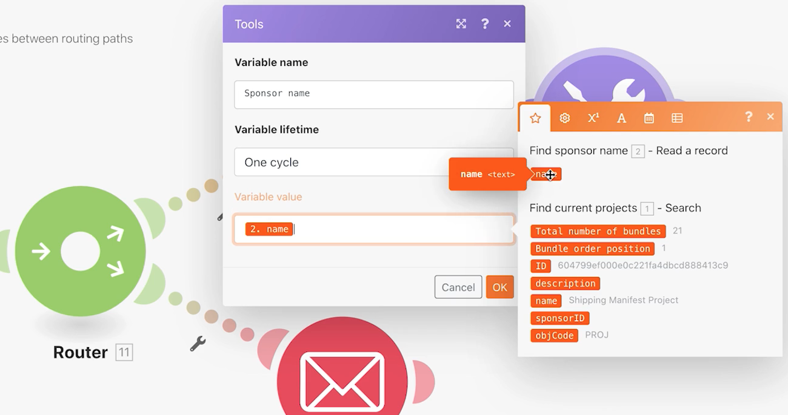
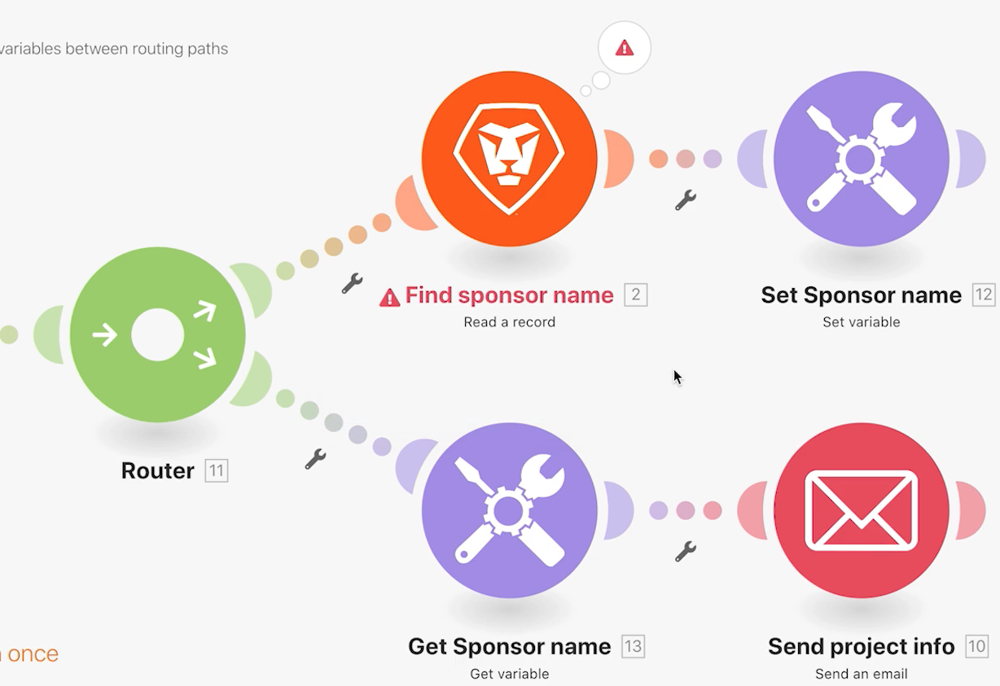
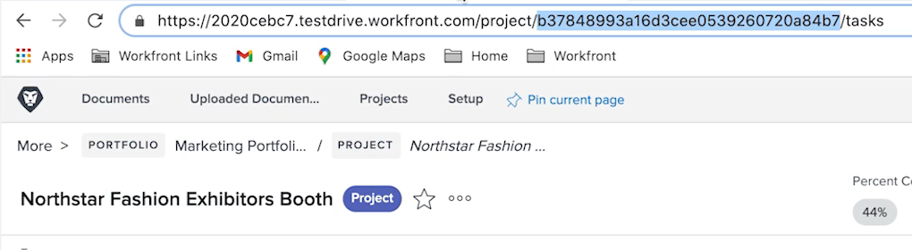
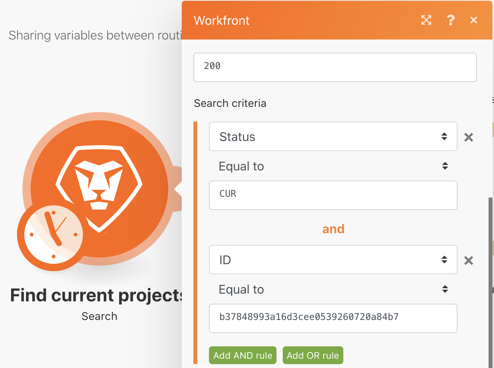

# Set/Get variables exercise

Learn how to use the Set and Get Variable modules to use the fields available in one path in a different path.

## Exercise overview

Look up information about a project in Workfront and send an email with related information.

   

## Steps to follow

1. Create a new scenario and name it "Sharing variables between routing paths."
1. For the trigger, select the Search module in the Workfront app.

   + Set the Record Type to Project.
   + For the Result set, choose All Matching Records.
   + For Search criteria, set it to Status Equal to CUR.
   + For Outputs, choose ID, Name, Description, and Sponsor ID.

   

   

1. Click OK and rename this module "Find current projects."
1. Add another module and select the Workfront Read a record module.

   + For the Record Type choose User.
   + For Outputs choose Name.
   + Map the Sponsor ID from the Search module to the ID field.

1. Click OK.
1. Rename the module "Find sponsor name."

   

1. Save the scenario and click Run once.

   If you receive an error on the Read a record module, it's likely due to the Search module finding a project without a sponsor listed.

   **To avoid this error, create two paths: one for projects that have a sponsor ID and one for projects that don't.**

1. Add a router between the two modules by clicking the wrench icon between the router and the Read a record module. Set up a filter named "Sponsor exists" and set the Condition to Sponsor ID Exists.

   

1. Click the router to create another path. Add a Send an email module from the Email app.

   + Put your own email address in the To field.
   + In the Subject field, type "Current project information."
   + In the Content field, put the project name, description, and sponsor.
   + You cannot pull the sponsor name output from the Read a record module. You can only access the sponsor ID from the search module before the router. You'll need to find a way to access the sponsor name from the other router path.

   

1. Click OK for now, and rename this module "Send project info"

   **Use Set/Get variables to share data between different paths.**

1. After the Find sponsor name module, add a Set variable tool module.

   + Put "Sponsor name" as the Variable name.
   + Leave the Variable lifetime at One cycle.
   + Map the field to the name output from the Find sponsor name module.

1. Click OK, then rename the module "Set Sponsor name."

   

1. Next, right-click between the router and the Send an email module to add a Get variable tool module. Enter "Sponsor name" in the Variable name field.
1. Click OK. Rename the module "Get Sponsor name."

   

1. Go back into the Send an email module and map the value from the Get Sponsor name module into the content field. Click OK.

   

   >[!IMPORTANT]
   >
   >Before you test the scenario, we recommend restricting the number of projects you process to avoid getting a flood of emails.

1. Go to your Workfront test drive and locate the Northstar Fashion Exhibitors Booth project. This is a current project that has a sponsor. Copy the project ID from the URL.

   

1. In your scenario, click the Find current projects module. Add another condition to the search criteria by clicking the green "Add AND rule" button. Specify that the ID must equal the project ID you copied. Click OK.
1. Save your scenario and click Run once.
1. Review the execution inspectors and the email you receive.

   
