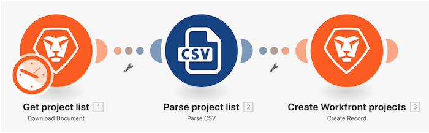

# Initial scenario design walkthrough

Create a new project in Workfront for each row in the Project List CSV file.



Workfront recommends watching the exercise walkthrough video before trying to recreate the exercise in your own environment.

In this video, you will learn how to:

* Create folders and new scenarios
* Use the scenario designer
* Create a basic scenario 

>[!VIDEO](https://video.tv.adobe.com/v/335261/?quality=12&learn=on&enablevpops=1)

**Here is the URL to paste in the "Redirect URLs" field when creating an OAuth app integration in your test drive instance**

```
https://app.workfrontfusion.com/oauth/cb/workfront-workfront

```

## Want to learn more? We recommend the following:

[Workfront Fusion documentation](https://experienceleague.adobe.com/en/docs/workfront-fusion/using/get-started-with-fusion/understand-workfront-fusion/workfront-fusion-overview)
