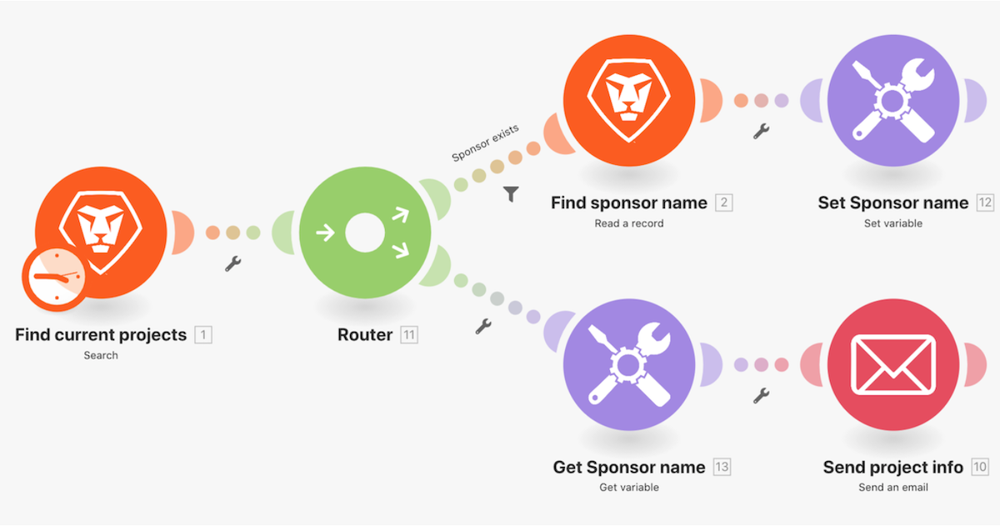

# Set/Get variables walkthrough

Look up information about a project in Workfront and send an email with related information.

## Get/Set variables walkthrough

Workfront recommends watching the exercise walkthrough video before trying to recreate the exercise in your own environment.

>[!VIDEO](https://video.tv.adobe.com/v/335276/?quality=12&learn=on&enablevpops=1)

## Your turn

>[!NOTE]
>
>Practice exercises and challenges are optional and are not necessary to complete Fusion training.

This practice exercise builds on what you learned in the walkthrough, but the solution is not provided.

Make a clone of the "Sharing variables between routing paths" scenario you created in this walkthrough. Email the message you compose to the project owner and the project sponsor. You also want to include the project condition in the message. (For now, it's okay that the condition appears as a two-letter key.)

**Challenge:** Schedule your scenario to send this "email" every week at 8 AM on Monday.

## Want to learn more? We recommend the following:

[Workfront Fusion documentation](https://experienceleague.adobe.com/en/docs/workfront-fusion/using/get-started-with-fusion/understand-workfront-fusion/workfront-fusion-overview)
