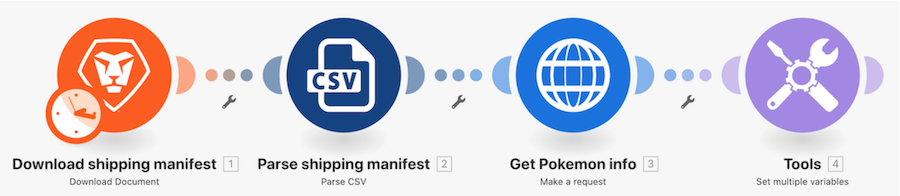

# Introduction to universal connectors walkthrough

## Overview

Using a Pokemon character in a spreadsheet, call the Poke API through an HTTP connector to gather and post more information on that character.

## Introduction to universal connectors walkthrough

Workfront recommends watching the exercise walkthrough video before trying to recreate the exercise in your own environment. 

>[!VIDEO](https://video.tv.adobe.com/v/335270/?quality=12&learn=on&enablevpops=1)

### Exercise URLs

Pokemon API website: `https://pokeapi.co/`

URL for exercise: `https://pokeapi.co/api/v2/pokemon/{Character}`

## Want to learn more? We recommend the following:

[Workfront Fusion documentation](https://experienceleague.adobe.com/en/docs/workfront-fusion/using/get-started-with-fusion/understand-workfront-fusion/workfront-fusion-overview)
