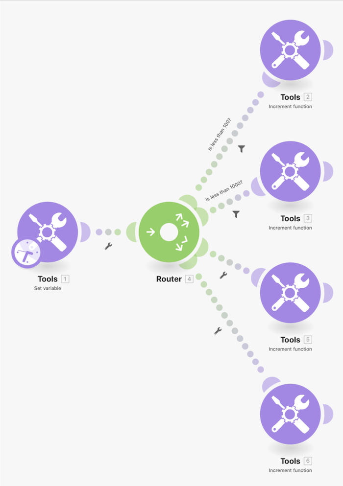

# Routing patterns walkthrough

Use the Set Variable module to send a number through multiple paths to see how filters and fallbacks behave when routing.

## Routing patterns walkthrough

Workfront recommends watching the exercise walkthrough video before trying to recreate the exercise in your own environment.

>[!VIDEO](https://video.tv.adobe.com/v/335274/?quality=12&learn=on&enablevpops=1)

## Want to learn more? We recommend the following:

[Workfront Fusion documentation](https://experienceleague.adobe.com/en/docs/workfront-fusion/using/get-started-with-fusion/understand-workfront-fusion/workfront-fusion-overview)
