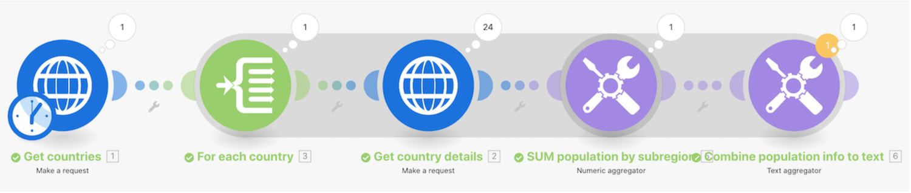

# Advanced aggregation walkthrough

Call a web service to return details about multiple countries and identify the total population of all countries, grouped by sub-region.

## Advanced aggregation walkthrough

Workfront recommends watching the exercise walkthrough video before trying to recreate the exercise in your own environment.

>[!VIDEO](https://video.tv.adobe.com/v/335281/?quality=12&learn=on&enablevpops=1)

## Exercise URLs

* `https://restcountries.com/v2/lang/es`
* `https://restcountries.com/v2/name/{country name}`

## Reinforcement of aggregation principle

Any time a module outputs multiple bundles, every module after that will execute each bundle.

To prevent this, add an aggregator after a module that potentially produces multiple bundles.

You'll see a shadow surrounding any segment in your scenario from a **beginning-iterator** to the **ending-aggregator**. This helps make these segments easy to spot in your Workfront Fusion scenario.

## Your turn

>[!NOTE]
>
>Practice exercises and challenges are optional and are not necessary to complete Fusion training.

This practice exercise builds on what you learned in the walkthrough, but the solution is not provided.

Create a new scenario to sum all hours logged on tasks in projects in the marketing portfolio. Then send one email that says "Your {Project Name} project team has logged {summed hours} of the total {planned hours} planned hours, putting you at {percentage} of the plan."

**Challenge:** See if you can do the same thing but for hours logged this year only.

## Want to learn more? We recommend the following:

[Workfront Fusion documentation](https://experienceleague.adobe.com/en/docs/workfront-fusion/using/get-started-with-fusion/understand-workfront-fusion/workfront-fusion-overview)
