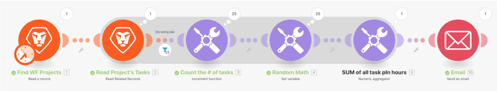

# Aggregation walkthrough

## Overview

Using the "Introduction to iteration" scenario you built in the last walkthrough, aggregate the planned hours on every working task in the project and send an email to yourself with that information.

## Aggregation walkthrough

Workfront recommends watching the exercise walkthrough video before trying to recreate the exercise in your own environment.

>[!VIDEO](https://video.tv.adobe.com/v/335280/?quality=12&learn=on&enablevpops=1)

## Want to learn more? We recommend the following:

[Workfront Fusion documentation](https://experienceleague.adobe.com/en/docs/workfront-fusion/using/get-started-with-fusion/understand-workfront-fusion/workfront-fusion-overview)
