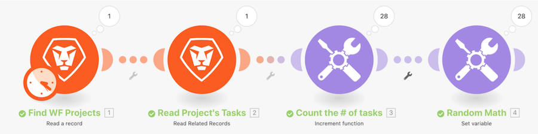

# Introduction to iterators walkthrough

Look at a specific project in Workfront, then look at all the tasks within that project. Then you will use the increment tool module to count the number of tasks within the project, Finally, you'll use the Set variable module to subtract the Number of Children from the Number of Open Issues to produce a numeric value for each of the task bundles.

## Introduction to iterators walkthrough

Workfront recommends watching the exercise walkthrough video before trying to recreate the exercise in your own environment.

>[!VIDEO](https://video.tv.adobe.com/v/335278/?quality=12&learn=on&enablevpops=1)

## Want to learn more? We recommend the following:

[Workfront Fusion documentation](https://experienceleague.adobe.com/en/docs/workfront-fusion/using/get-started-with-fusion/understand-workfront-fusion/workfront-fusion-overview)
