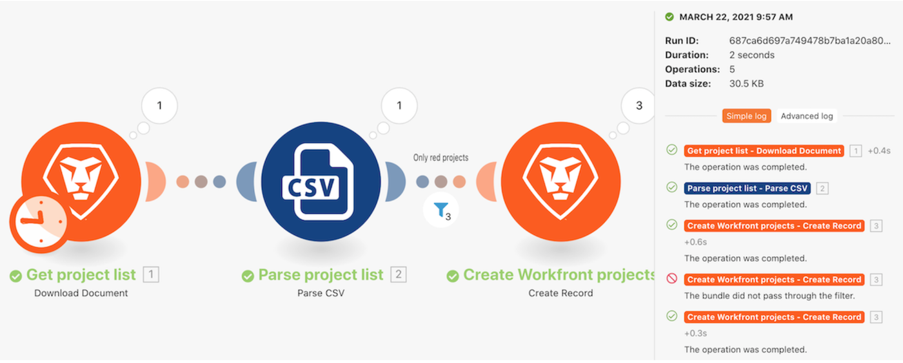
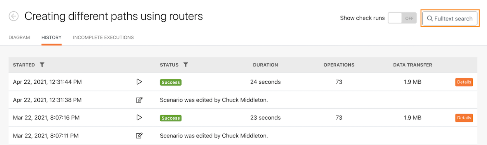
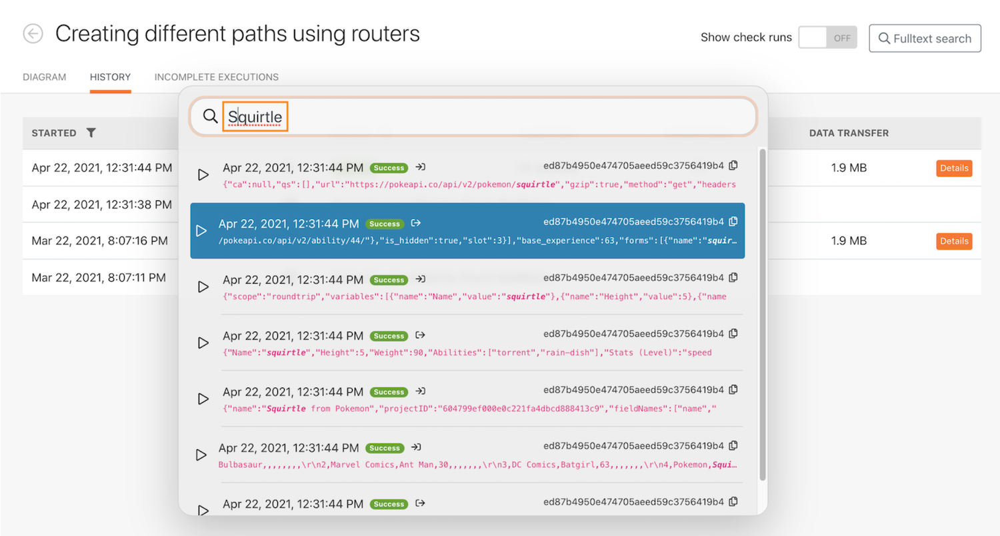
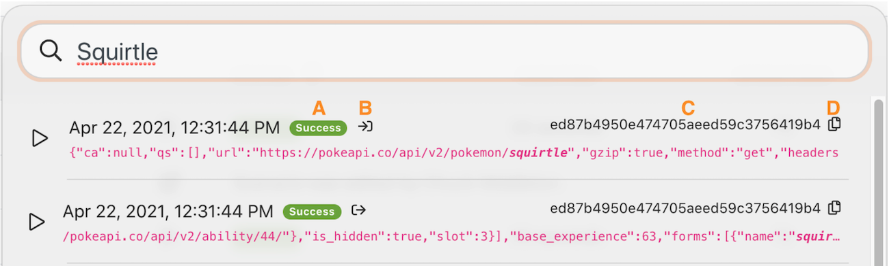
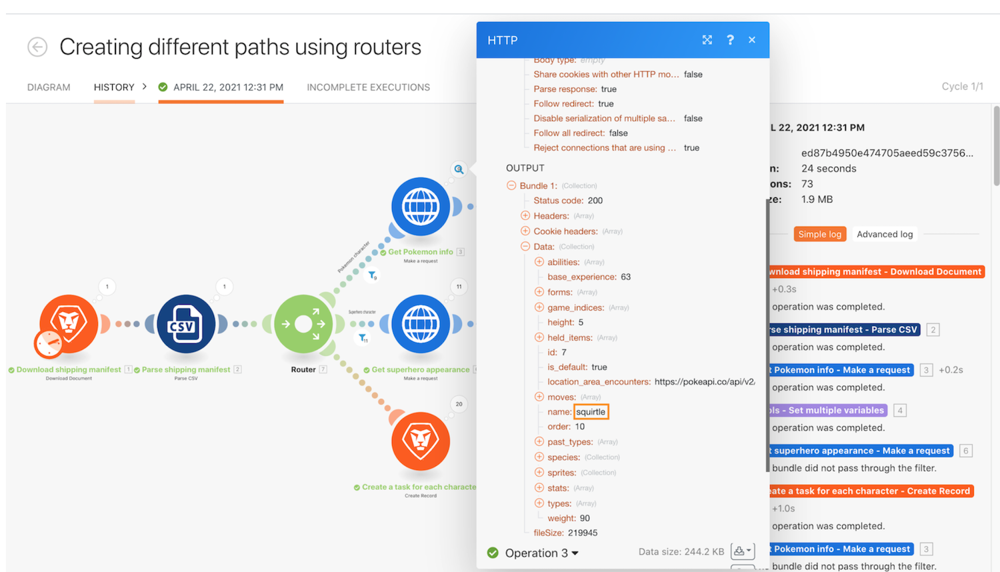

# Execution history walkthrough

Review the execution history for the "Using the mighty filter" scenario to understand what happened when executions occurred and how they were structured when they were run.

## Execution history walkthrough

Workfront recommends watching the exercise walkthrough video before trying to recreate the exercise in your own environment.

>[!VIDEO](https://video.tv.adobe.com/v/335283/?quality=12&learn=on&enablevpops=1)

## Fulltext search in the history tab

Fulltext search is available in the history tab of a scenario, allowing you to search for any data processed in the scenario.

Instead of opening each execution to search for data, Fulltext search searches across all executions within a single scenario. The search results provide a list of executions where the data was found, and you can click any execution to explore further. 

The search results contain some useful icons in the image below. 

A—The status of the execution.

B—Whether the data was in the input or the output of the module in which it was found.

C—The execution ID. 

D—Copy the execution ID.

When you click on an execution, Workfront Fusion loads the execution and the module where the search result was found. And it opens the execution inspector on the module that contains the search data.

## Want to learn more? We recommend the following:

[Workfront Fusion documentation](https://experienceleague.adobe.com/en/docs/workfront-fusion/using/get-started-with-fusion/understand-workfront-fusion/workfront-fusion-overview)
