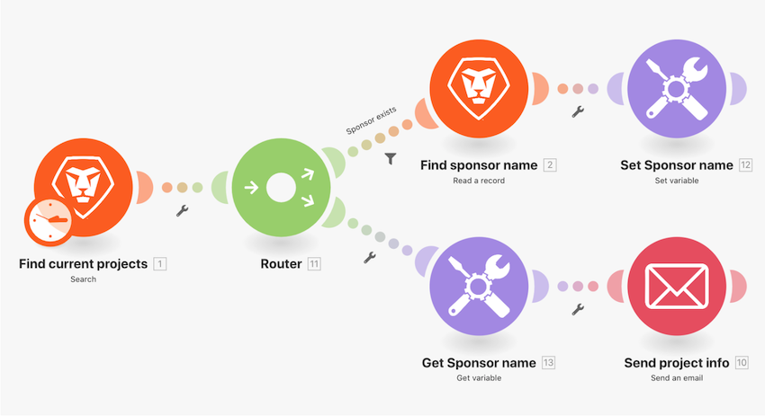

# Switch function walkthrough

For simple data changes, use the Switch function to transform one value to another within a module field. In this exercise, change the two-letter key to the actual name for project Progress Status sent in an email.

## Switch function walkthrough

Workfront recommends watching the exercise walkthrough video before trying to recreate the exercise in your own environment.

>[!VIDEO](https://video.tv.adobe.com/v/335289/?quality=12&learn=on&enablevpops=1)

## Want to learn more? We recommend the following:

[Workfront Fusion documentation](https://experienceleague.adobe.com/en/docs/workfront-fusion/using/get-started-with-fusion/understand-workfront-fusion/workfront-fusion-overview)
