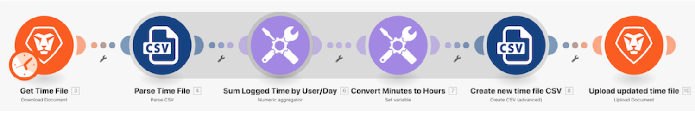

# Data structures walkthrough

Open a CSV file that contains a list of time entries. These time entries are for minutes logged throughout certain days by multiple users. The goal is to take this information and produce a new CSV that shows the total time, in hours, logged by each user, each day.

## Data structures walkthrough

Workfront recommends watching the exercise walkthrough video before trying to recreate the exercise in your own environment.

>[!VIDEO](https://video.tv.adobe.com/v/335294/?quality=12&learn=on&enablevpops=1)

## Want to learn more? We recommend the following:

[Workfront Fusion documentation](https://experienceleague.adobe.com/en/docs/workfront-fusion/using/get-started-with-fusion/understand-workfront-fusion/workfront-fusion-overview)
