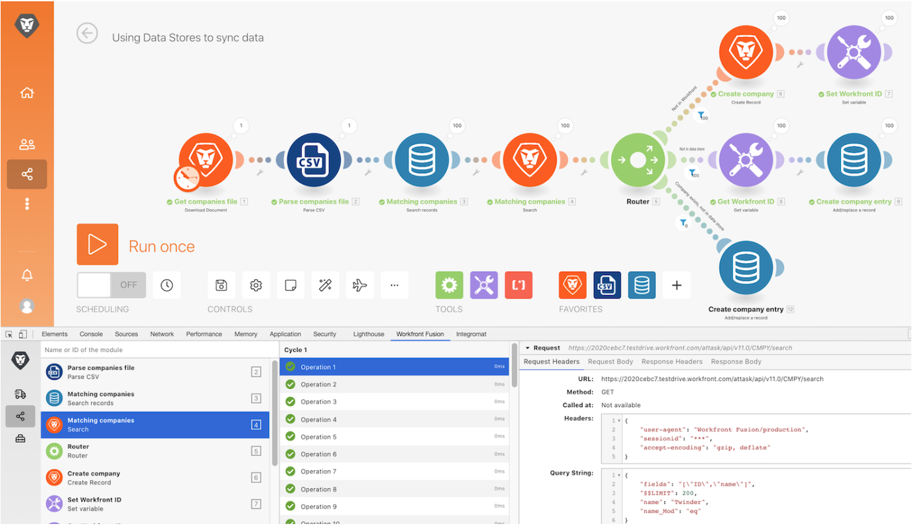

# Dev tool walkthrough

Install and use the different areas in the Workfront Dev Tool to take a deeper dive into requests/responses made and advanced scenario design tricks.

## Dev tool walkthrough

Workfront recommends watching the exercise walkthrough video before trying to recreate the exercise in your own environment.

>[!VIDEO](https://video.tv.adobe.com/v/335303/?quality=12&learn=on&enablevpops=1)

## Download the Dev tool

The Dev Tool has a number of advanced features that improve your ability to understand and troubleshooting scenarios. Download the "workfront-fusion-devtool.zip" document found in the Fusion Exercise Files folder in your test drive.

## Want to learn more? We recommend the following:

[Workfront Fusion documentation](https://experienceleague.adobe.com/en/docs/workfront-fusion/using/get-started-with-fusion/understand-workfront-fusion/workfront-fusion-overview)
