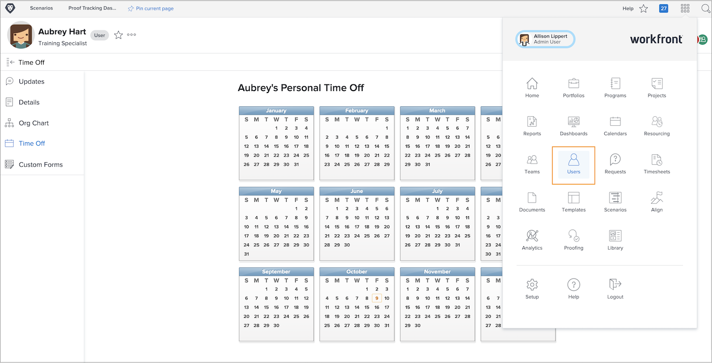

# Manage other user's time off

Managers or other leaders can manage their team members’ time-off calendars if they have Edit User permissions assigned through their Workfront access level. Access levels are created and assigned by Workfront system administrators.

Workfront recommends that your organization have a policy or procedure for when a manager updates an employee’s personal time off calendar.

To manage another user’s calendar:

* Click the [!UICONTROL Main Menu] and select Users.

* Use the search icon to find the user or scroll through the list.

* Click the user’s name in the list.

* Click [!UICONTROL Time Off] in the left panel menu on the user’s profile page.

* Click a date on the calendar.

* Workfront assumes a full day off. If that’s the case, go ahead and click the [!UICONTROL Save] button.

* For multiple consecutive days off, change the To date to the last day out of the office. Click the [!UICONTROL Save] button.

* If marking a partial day off, uncheck the [!UICONTROL All Day] box. Then indicate the hours the user will work that day (the hours they’re available). Click the [!UICONTROL Save] button.
