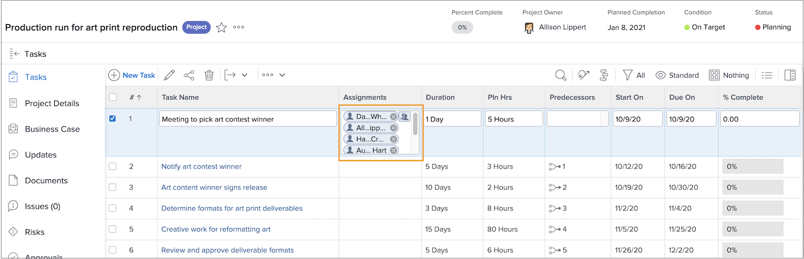
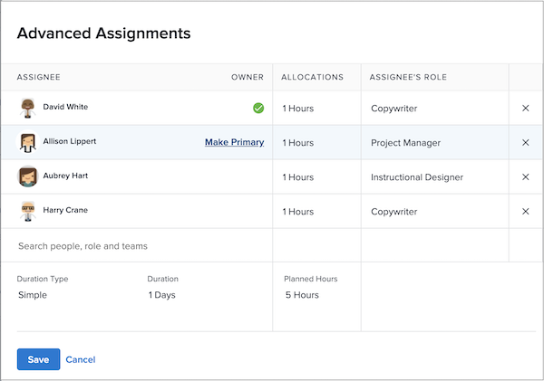
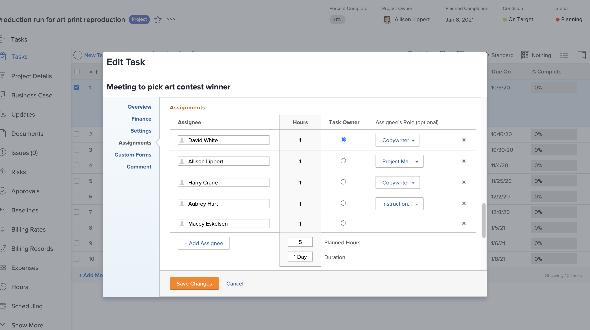

# What is a primary assignee?

A primary assignee exists when two or more users are assigned to a task. The time off calendar of the primary assignee is what Workfront looks at when applying the User Time Off setting.

Find out who the primary assignee is from the project page. Click into the Assignments field, then click the advanced assignments icon in the corner.

In the Advanced Assignments window, the primary assignee, or task owner, is designated with a green checkmark. Hover over another user and click the Make Primary link to change the task owner.

You can also adjust the primary assignee from the task page. Check the box on the task in the project list, then click the Edit icon. Scroll to the Assignments section and click the button to designate the task owner.

