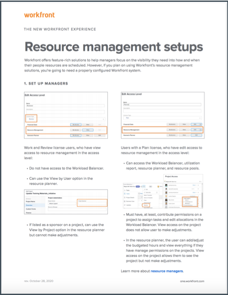
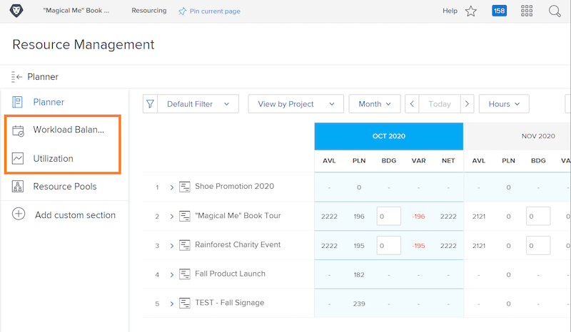

# Resource management setups, Workload Balancer, and utilization report

[!DNL Workfront] offers data, across multiple tools in [!DNL Workfront], to help make your resource decisions easier and your processes smoother. To see what's going on with your resources, you should make sure your managers, your users, and your projects are configured properly. These configurations are helpful even if you don't plan on using all of [!DNL Workfront's] resource management tools.

In this section you will learn:

* How to set up resource managers with the right access
* How to view the Workload Balancer and utilization report

## Resource management setups

Let's start with making sure the right people have access to and can administer your organization's resources. 

<!Download the guide for step-by-step instructions.>

## Workload Balancer and utilization report

Along with the Resource Planner and Resource Pools, users have access to additional tools such as the Workload Balancer and the utilization report when given the Edit permission in the access level.

No other setting is necessary to access or manage resources through these tools.

