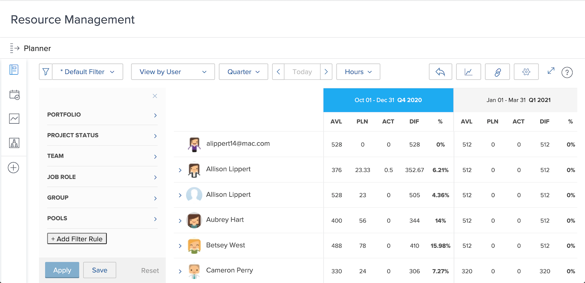

# View utilization and filter the Resource Planner

With the Resource Planner, you gain a clear view of the projects you're interested in and a real-time look at how your workforce stacks up to execute them.

* For example, you want to know what happens to capacity when the latest server update initiative becomes your top priority. 

* The Resource Planner shows your people’s availability and how allocating resources to one project will impact the availability on lower-priority projects.

You’ll be able to see not only how allocating resources affects today’s work, but as you look beyond your immediate resource scheduling needs you can evaluate longer-term resource allocations to understand if individuals are over (or under) allocated.

## Filter the Resource Planner

The Resource Planner automatically opens with a default set of filters. You will want to edit those filters by:

* Time frame
* Portfolio/Program
* Resource Pools, etc.

This allows you to focus on what resources are available and when.
