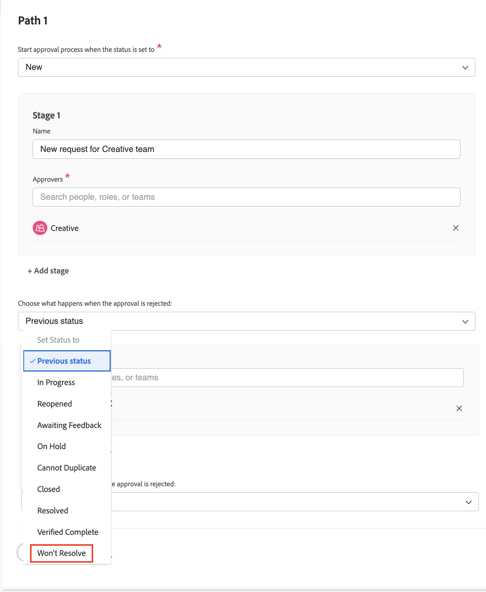

# Create a global and a single-use approval process

Approval processes on projects, tasks, and issues allow a project manager to get expert confirmation that the work has been done right before moving forward. The project manager can create an approval process for each situation (this is known as a single-use approval process) or choose from a list of possibly many approval processes that have been created previously to meet common needs (these are known as global, or existing, approval processes).

In either instance, when the object status changes to one specified in the approval process the approver is notified in various ways to review the work and approve or reject it. Given that the entire project may be paused waiting for an approval, approvers should be aware in advance that they may be called on for an approval. If an approver is out of the office for any reason they may delegate their approvals to a qualified substitute. See [Delegate tasks, issues, and approvals](/help/manage-work/approval-processes-and-milestone-paths/delegate-approvals.md) for details.

In this video, you will learn how to create a global approval process and a single-use approval process on a project, task, or issue.

>[!VIDEO](https://video.tv.adobe.com/v/335225/?quality=12&learn=on)

>[!TIP]
>
>You can add a single use approval process for a project or task to a project template.

>[!NOTE]
>
>You can set up a single use approval on projects and issues in the same way as described for tasks in the video.

## How to apply automatic issue approvals in a request queue

If you want to set up automatic issue approvals in a request queue, these can only be done using a global issue approval process and are applied in a [!UICONTROL Queue topic]. 

When creating or editing a [!UICONTROL Queue topic], select the global approval process in the **[!UICONTROL Default Approval]** field.

You may need to edit the issue approval process to make sure **[!UICONTROL Previous status]** is not what the issue is set to when the approval is rejected. This is because the previous status is **[!UICONTROL New]**, and this is also the status that triggers the approval process, so it is the status it will be set to when approved. To avoid confusion when the issue approval is rejected, it's better to set the status to something like **[!UICONTROL Won't Resolve]**, or a custom status created for this purpose.

## Recommended tutorials on this topic

* [Delegate tasks, issues, and approvals](/help/manage-work/approval-processes-and-milestone-paths/delegate-approvals.md)
* [Understand group-specific approval processes](/help/administration-and-setup/approval-processes-and-milestone-paths/group-specific-approval-processes.md)
* [Create a request flow](/help/manage-work/request-queues/create-a-request-flow.md)

