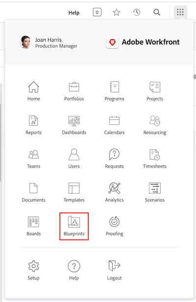

# Create a project template and learn about [!UICONTROL Blueprints]

Learn to create a project template from scratch and from an existing project, and understand how [!UICONTROL Blueprints] can give you access to a world of useful project templates created by Workfront experts.

## Create a project template

* The video provides a step-by-step guide on creating and using templates for marketing video production. It starts by explaining how to create a new template from scratch, naming it, and saving it. ​ The process involves three main steps: creating tasks, setting up the timeline using durations and predecessors, and making assignments to job roles rather than individual users. ​ The video emphasizes organizing tasks using parent-child relationships for better summarization and efficiency. ​
* Once the template is created, it can be used to produce new projects. The video demonstrates how to create a new project from the template, make necessary adjustments, and add tasks or modify durations as needed. ​ It also shows how to assign job roles to tasks using resource scheduling and planning functionalities. ​
* The video explains how to save an existing project as a new template, allowing for updates and improvements in the workflow. ​ It highlights the importance of managing templates to avoid confusion and ensure streamlined project execution. ​

>[!VIDEO](https://video.tv.adobe.com/v/335210/?quality=12&learn=on)

## Key takeaways

**Creating a Template:** Learn how to create a new template from scratch by naming it, setting up tasks, timelines, and making assignments to job roles. ​
**Task Organization:** Use parent-child task relationships to organize tasks efficiently, providing a clear summary and structure for the project. ​
**Timeline Setup:** Set up task timelines using durations and predecessors to estimate the time frame and sequence of tasks accurately. ​
**Role-Based Assignments:** Assign tasks to job roles rather than individual users to utilize resource scheduling and planning functionalities effectively. ​
**Template Management:** Save existing projects as new templates to incorporate improvements and manage templates to avoid confusion and ensure efficient project execution. ​

## Templates created with [!UICONTROL Blueprints] 

  Workfront users can use [!UICONTROL Blueprints] to help build project templates. This feature, located in the Main Menu, allows you to access pre-built, ready-to-use templates that are targeted to a department and specific maturity level. These templates give users a head start to repeatable project creation and help maintain consistency across projects similar in scope. 

Any licensed user can browse the list of blueprints available in Workfront. You cannot apply a blueprint directly when creating a new project (such as converting a task or request into a project). A key difference between a blueprint and a project template is that a blueprint is used to make a template, whereas a template is used to create a project. **The blueprint needs to be installed by a system administrator for the corresponding template to be created.**

If you find a blueprint that looks interesting, you can click on **[!UICONTROL Details]** to learn more about it. 

The [!UICONTROL Details] screen explains more about the blueprint, including the installation history if the blueprint has been installed.

If the blueprint was installed, you can click on **[!UICONTROL See details]** to get links to the template that was created and any other objects that were created to support the template.

If the blueprint has not yet been installed you can request it from your system administrator.

## Recommended tutorials on this topic

* [Create a project directly from a template](/help/manage-work/create-and-manage-project-templates/create-a-project-directly-from-a-template.md)
* [Share a project template](/help/manage-work/create-and-manage-project-templates/share-a-project-template.md)
* [Copy an existing project](/help/manage-work/manage-projects/copy-an-existing-project.md)
* [Deactivate a project template](/help/manage-work/create-and-manage-project-templates/deactivate-a-project-template.md)
* [Edit the project team in a project template](/help/manage-work/create-and-manage-project-templates/edit-the-project-team-in-a-project-template.md)
