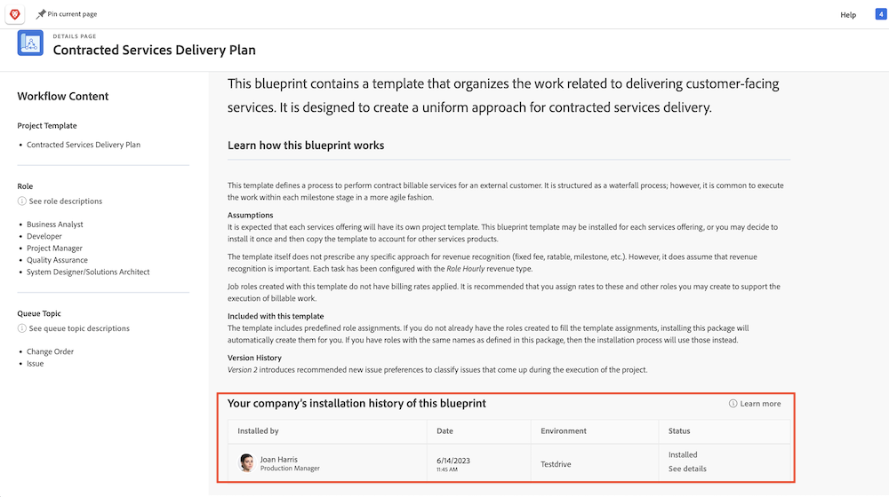

# Create a project template and learn about [!UICONTROL Blueprints]

Learn to create a project template from scratch and from an existing project, and understand how [!UICONTROL Blueprints] can give you access to a world of useful project templates created by Workfront experts.

## Create a project template

In this video, you will learn how to:

* Create a template from scratch
* Create a template from an existing project

>[!VIDEO](https://video.tv.adobe.com/v/335210/?quality=12&learn=on)

## Templates created with [!UICONTROL Blueprints] 

  Workfront users can use [!UICONTROL Blueprints] to help build project templates. This feature, located in the Main Menu, allows you to access pre-built, ready-to-use templates that are targeted to a department and specific maturity level. These templates give users a head start to repeatable project creation and help maintain consistency across projects similar in scope. 

Any licensed user can browse the list of blueprints available in Workfront. You cannot apply a blueprint directly when creating a new project (such as converting a task or request into a project). A key difference between a blueprint and a project template is that a blueprint is used to make a template, whereas a template is used to create a project. **The blueprint needs to be installed by a system administrator for the corresponding template to be created.**

If you find a blueprint that looks interesting, you can click on **[!UICONTROL Details]** to learn more about it. 

The [!UICONTROL Details] screen explains more about the blueprint, including the installation history if the blueprint has been installed.

If the blueprint was installed, you can click on **[!UICONTROL See details]** to get links to the template that was created and any other objects that were created to support the template.

If the blueprint has not yet been installed you can request it from your system administrator.
