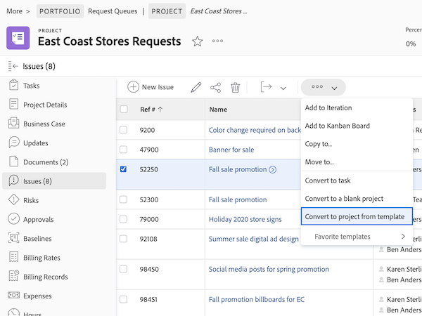

# Convert an issue/request to a project

In this video, you will learn how to:

* Review the information submitted with the request
* Select the appropriate project template
* Complete the conversion from request to project

>[!VIDEO](https://video.tv.adobe.com/v/340343/?quality=12&learn=on)

## What you need to know about the [!UICONTROL Options] section

The [!UICONTROL Options] section may be hidden by the system administrator if they want you to use the defaults they have set. If the [!UICONTROL Options] section does appear, here what the options mean:

**Keep the original issue and tie its resolution to this project**

If this option is selected, the original issue will marked as resolved when the project is completed. If this option is **not** selected, the original issue will be deleted on project creation.

**Allow (user's name) to have access to this project**

If this option is selected, the person who made the request (or on who's behalf the request was made) will automatically be given access rights to the new project once it is created. If this option is **not** selected, they will not be automatically given any rights.

## Maintain information during the conversion process

Transferring the custom form data requires either:

* Multiple copies of the same custom form—one for the issue, then one for the task or project. The fields on these custom forms should be an exact match, so the information can transfer from one custom form to the other.

* You can use a single custom form in which the issue, task, and/or project objects are all selected. Using this method you only need to create and maintain your custom fields in a single custom form. This is much easier than having multiple copies of the same form, but either method will work.

If you include a custom form in a project template it will automatically be assigned when the template is selected in the conversion process.

## Convert an issue to a task or project from any issue list

To increase the efficiency of your work and make it easier to convert issues in a fast-paced environment, you have the ability to convert an issue to a task or a project from any issue list in a project, report, or dashboard. Just select an issue and then click on the 3-dot menu that appears.

## Recommended tutorials on this topic

* [Convert an issue/request to a task](/help/manage-work/issues-requests/convert-issues-to-other-work-items.md)
* [Handle Unplanned Work](/help/manage-work/issues-requests/handle-unplanned-work.md)

