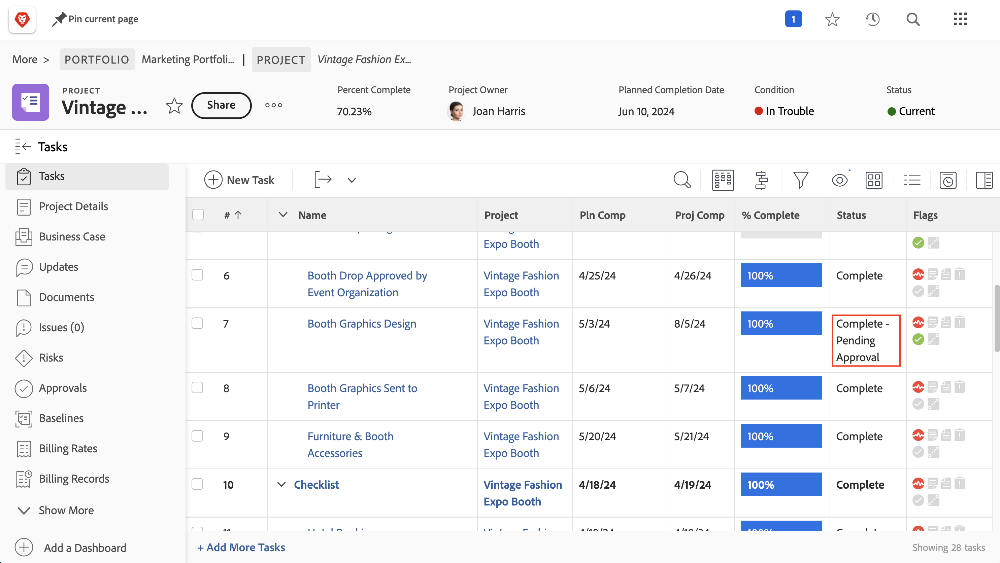
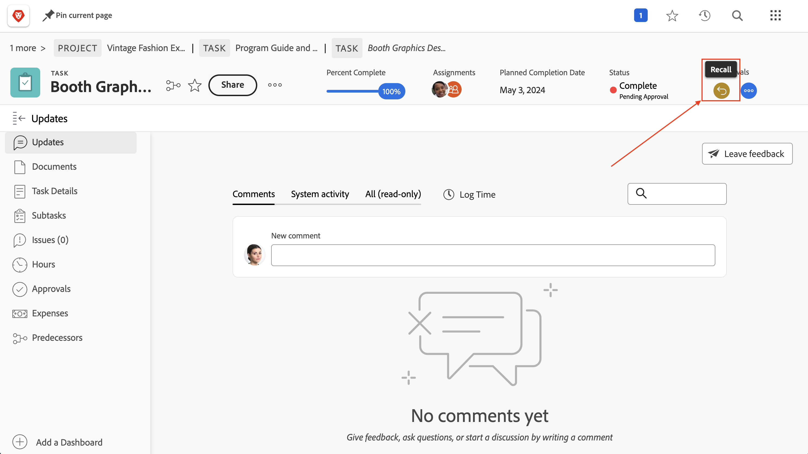

# Complete approvals

Task and issue approvals are a part of many projects. But unresolved approvals will prevent you from setting the project status to Complete.

Here's how to find them and deal with them.

On the [!UICONTROL Task] section of your project, select a [!UICONTROL View] that includes the [!UICONTROL Status] column, such as the [!UICONTROL Status] view. A quick glance down that column will show if there's an incomplete approval on a task with the words "[!UICONTROL - Pending Approval]" after the name of the status.

When you find a task that's still awaiting approval, you have a two choices of what to do:

## Complete the approval

This may mean reminding the person assigned of the outstanding approval. You can see who is assigned as an approver by opening the task and clicking on the three-dot menu in the approvals area.

A box will appear showing the assigned approver.

## Remove the approval

If the approval isn't needed, you may want to remove it. You can do this by first recalling the approval. Click the [!UICONTROL Recall] button in the approvals area. This will change the status back to its previous status and will allow you to remove the approval process.

Now click on the [!UICONTROL Approvals] tab on the left, then on the [!UICONTROL Remove] button on the upper right.

## Dealing with issue approvals

If your organization uses issues to track problems, change orders, or other events during projects, follow the same steps on the [!UICONTROL Issues] section of your project.
