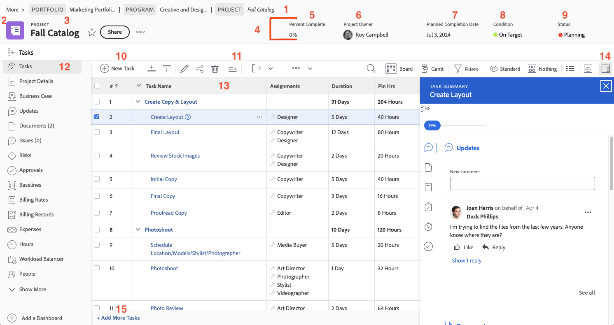

# Navigate the project page

In this video, you learn:

* How to view the details of the project
* What information shows in the task list
* Where to upload documents
* How to view the update history

>[!VIDEO](https://video.tv.adobe.com/v/335085/?quality=12&learn=on&enablevpops=1)

## Key parts of the project page

The project page is filled with many features to help you manage your work. Work with your system administrator if there is an option you need but don't see in your instance of [!DNL Workfront]. Here are a few of the main project page features to make note of.

1. **Breadcrumb trail:** Navigate through the program and portfolio hierarchy behind the project.
2. **Object type:** Showing the object type on the landing page helps you identify what you're looking at in [!DNL Workfront]. The "project" term is customizable by your [!DNL Workfront] system administrator.
3. **Project name:** The name of the project that you're viewing. Click the name to edit it.
4. **Project header:** Standard information that's available on all project pages.
5. **[!UICONTROL Percent complete]:** This updates automatically, based on the tasks completed in the project.
6. **[!UICONTROL Project Owner]:** At most organizations, this is the project manager. This is the person responsible for managing the project in [!DNL Workfront] and ensuring that it's completed.
7. **[!UICONTROL Planned Completion Date]:** The planned completion date of the project is set by the project manager through the project timeline.
8. **[!UICONTROL Condition]:** The [!UICONTROL Condition] is a visual representation of how the project is progressing. [!DNL Workfront] can automatically configure the [!UICONTROL Condition] based on the progress status of the tasks in the project. Or [!UICONTROL Condition] can be set manually through the project details.
9. **[!UICONTROL Status]:** The [!UICONTROL Status] indicates where the project stands in the process: is the project still being planned, is the project in progress, or is the project complete.
10. **[!UICONTROL New Task]:** Click to create a task in the project. The task generates at the bottom of the list.
11. **[!UICONTROL Export]:** Export the task list or selected tasks to a PDF, spreadsheet, or tab delimited file.
12. **Left panel menu:** Navigate to different information about the project with the left panel. Click the Task icon at the top to collapse the panel if you need a bit more space on your screen. Drag and drop the icons so the order helps you work efficiently. The options you see are set by your [!DNL Workfront] system administrator.
13. **Task list:** The task list shows all the tasks that make up your project plan. The information visible about each task is determined by the view selected.
14. **Summary panel:** The summary panel provides a quick look into information about the selected task. Click the ummary panel icon to open or close.
15. **Add More Tasks** Click here to add another task to the bottom of the task list using inline edit.

## Recommended tutorials on this topic

* [Understand basic project creation](/help/manage-work/projects/understand-basic-project-creation.md)
* [Learn four ways to create a project](/help/manage-work/projects/understand-other-ways-to-create-projects.md)
* [Fill in the project details](/help/manage-work/projects/fill-in-the-project-details.md)
