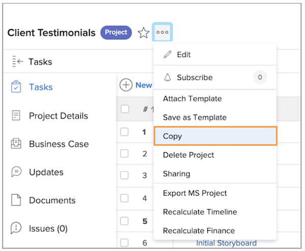
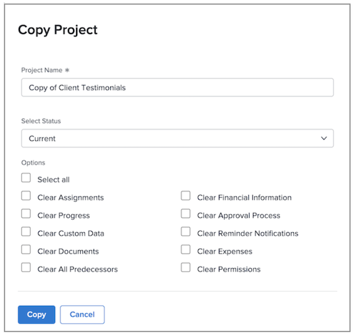

# Copy an existing project

Sometimes, instead of using a template to create a project, you just need to copy a project for another one-time use. To do this, you must have a Standard license, with Edit and Create access to projects. 

Navigate to the project you want to copy and click the 3-dot menu next to the project name. Then select Copy.

The Copy Project window lets you change the title and status, as well as clear a variety of data associated with the project—options like assignments, documents, and custom data.

Selecting Clear Assignments or setting the status to Planning prevents the copied project from sending out task assignment notifications right after copying.

## Recommended tutorials on this topic

* [Create a project directly from a template](/help/manage-work/create-and-manage-project-templates/create-a-project-directly-from-a-template.md)
* [Work with tasks](/help/manage-work/tasks/work-with-tasks.md)
* [Assign tasks from the project plan](/help/manage-work/tasks/assign-tasks-from-the-project-plan.md)
