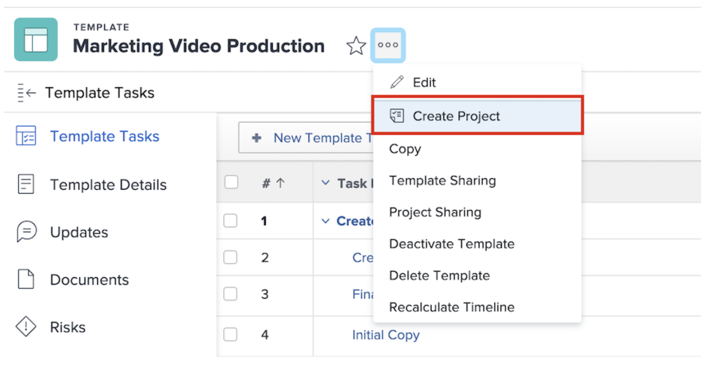

# Create a project directly from a template

If you happen to be working on a template and need to create a project using that template, click the 3-dot menu next to the template name. Then select Create Project.

The details window allows you to make changes to the settings of the new project.

>[!NOTE]
>
>In order to create a project using this method, you need access to the Templates area of Workfront. If you are unable to access templates, you can still use a template to create a project from the Projects area or when converting an issue/task. 

>[!TIP]
>
>If there's a template you use frequently, make it a favorite! You'll see the template listed in the New Project menu, in addition to it appearing under the Favorites menu in the navigation bar. 

## Recommended tutorials on this topic

* [Create a project template and learn about Blueprints](/help/manage-work/create-and-manage-project-templates/create-a-project-template.md)
* [Share a project template](/help/manage-work/create-and-manage-project-templates/share-a-project-template.md)
* [Copy an existing project](/help/manage-work/manage-projects/copy-an-existing-project.md)
* [Deactivate a project template](/help/manage-work/create-and-manage-project-templates/deactivate-a-project-template.md)
* [Edit the project team in a project template](/help/manage-work/create-and-manage-project-templates/edit-the-project-team-in-a-project-template.md)

