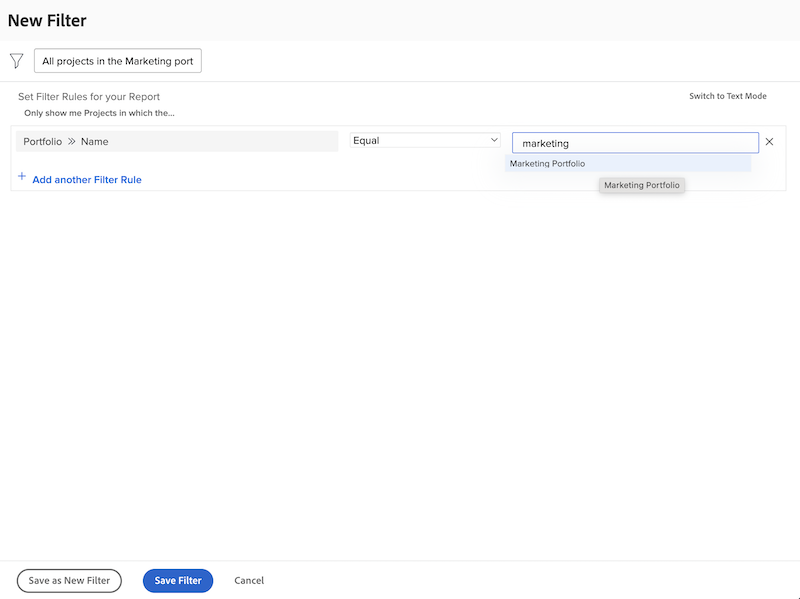

# Create basic filter activities

## Activity 1 - All projects in the Marketing portfolio

In this activity you will create a project filter named "All projects in the Marketing portfolio" in the [!UICONTROL Legacy filter] experience. This will show you all the projects in the portfolio named "Marketing Portfolio" regardless of their status.

Step-by-step instructions are included below. 

## Answer to Activity 1

1. Navigate to the [!UICONTROL Projects] area from the [!UICONTROL Main Menu]. This shows you a list of projects.
1. Click the **[!UICONTROL Filter]** menu and select [!UICONTROL Legacy Filters].
1. Select **[!UICONTROL New Filter]**.
1. Name your filter "All projects in the Marketing portfolio."
1. Click **[!UICONTROL Add Filter Rule]**.
1. In the [!UICONTROL Start typing field name] field, type "[!UICONTROL portfolio name]". Then select [!UICONTROL Name] under the [!UICONTROL Portfolio] field source.
1. Leave the [!UICONTROL Equal] operator as it is.
1. Type "[!UICONTROL marketing]" in the [!UICONTROL Start typing name] field.
1. Select [!UICONTROL Marketing Portfolio] assuming you have a portfolio of that name you want to filter on. If not simply use the type ahead feature to find the portfolio you want.
1. Click **[!UICONTROL Save Filter]**.

## Activity 2 - Projects I own closing this month

In this video, you will create a project filter named "Projects I own closing this month" in the [!UICONTROL Legacy filter] experience. If you're keeping an eye on a lot of projects, this filter can help you zoom in on the ones that are planned to close soon.

Step-by-step instructions are included below. 

>[!VIDEO](https://video.tv.adobe.com/v/336807/?quality=12&learn=on&enablevpops)

## Answer to Activity 2

1. Navigate to the [!UICONTROL Projects] area from the [!UICONTROL Main Menu]. This shows you a list of projects.
1. Click the **[!UICONTROL Filter]** menu and select [!UICONTROL Legacy Filters].
1. Select **[!UICONTROL New Filter]**.
1. Name your filter "Projects I own closing this month."
1. Click **[!UICONTROL Add Filter Rule]**.
1. In the [!UICONTROL Start typing field name] field, type "owner". Then select [!UICONTROL Owner ID] under the [!UICONTROL Project] field source.
1. Leave the [!UICONTROL Equal] operator as it is.
1. Type "$$" in the [!UICONTROL Start typing name] field.
1. Select [!UICONTROL $$USER.ID]. This is the wildcard for the logged-in user.
1. Click [!UICONTROL Add Filter Rule] again.
1. In the [!UICONTROL Start typing field name] field, start typing "Is Complete". Then select [!UICONTROL Is Complete] under the Project field source.
1. Leave the [!UICONTROL Equal] operator as it is.
1. Select "False."
1. Click [!UICONTROL Add Filter Rule] again.
1. In the [!UICONTROL Start typing field name] field type "planned", then select [!UICONTROL Planned Completion Date] under the [!UICONTROL Project] field source.
1. Change the [!UICONTROL Equal] operator to [!UICONTROL This Month].
1. Click **[!UICONTROL Save Filter]**.
