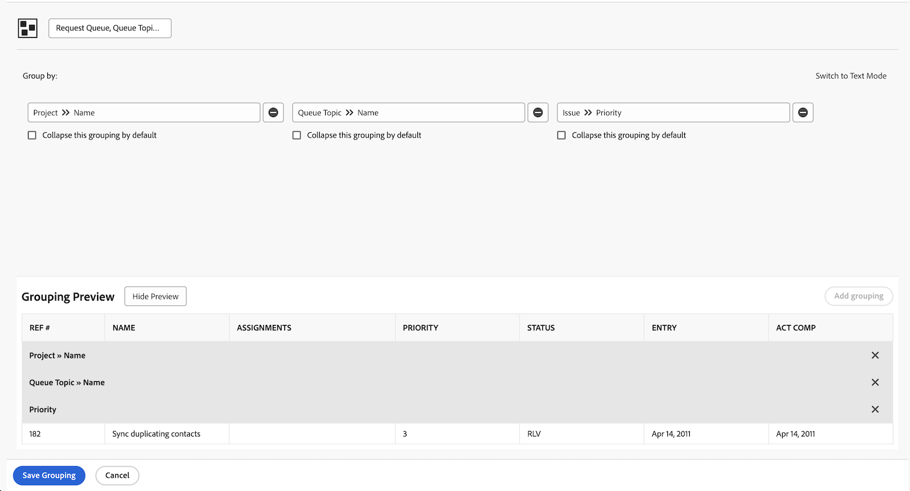

# Create a basic grouping

This video explains how to create and manage groupings in Workfront to organize project lists effectively. ​ Groupings are one of the three main reporting elements, alongside filters and views, and they help organize results based on shared information. ​
This tutorial provides practical steps for organizing project lists to streamline daily work and collaboration. ​

>[!VIDEO](https://video.tv.adobe.com/v/335147/?quality=12&learn=on&enablevpops=0

## Key takeaways

* **Purpose of Groupings:** Groupings are a key reporting element in Workfront that organize project lists based on shared information, such as completion dates, portfolios, or programs. ​
* **Creating Groupings:** You can create custom groupings with up to three levels of criteria. ​ For example, projects can be grouped first by portfolio and then by program for better organization. ​
* **Editing and Saving Groupings:** Built-in groupings cannot be overwritten, but you can save edits as a new grouping. ​ Custom groupings should have clear, descriptive names for easy identification. ​
* **Sharing Groupings:** Groupings can be shared with other users, with default "view" permissions allowing them to use and share the grouping but not edit it. "​Manage" permissions allow editing and deletion. ​
* **Removing Groupings:** Deleting a grouping you created will also remove it from the lists of users you shared it with. ​ Shared groupings appear under the "Shared with Me" section for other users. ​

## "Create a basic grouping" activities

### Activity 1: Create a basic grouping

Create an issue grouping that will be used in a report to track requests that come through a request queue. This grouping will make it easy to see similar types of issues/requests grouped by their priority. Name the grouping "Request Queue, Queue Topic, Priority."

Group the issue report based on:

1. The name of the request queue (this will be the project name)
1. The queue topic
1. The priority of the request

### Answer 1

1. In an issue list report, go to the **[!UICONTROL Grouping]** menu and select **[!UICONTROL New Grouping]**.
1. Name your grouping "Request Queue, Queue Topic, Priority."
1. Click **[!UICONTROL Add Grouping]**.
1. In the [!UICONTROL Group by] field. type "project name" then select **[!UICONTROL Name]** under the Project field source.
1. Click **[!UICONTROL Add another Grouping]**, then type "queue" and select **[!UICONTROL Name]** under the [!UICONTROL Queue Topic] field source.
1. Click **[!UICONTROL Add another Grouping]**, then type "priority" and select **[!UICONTROL Priority]** under the [!UICONTROL Issue] field source.
1. Click **[!UICONTROL Save Grouping]**
