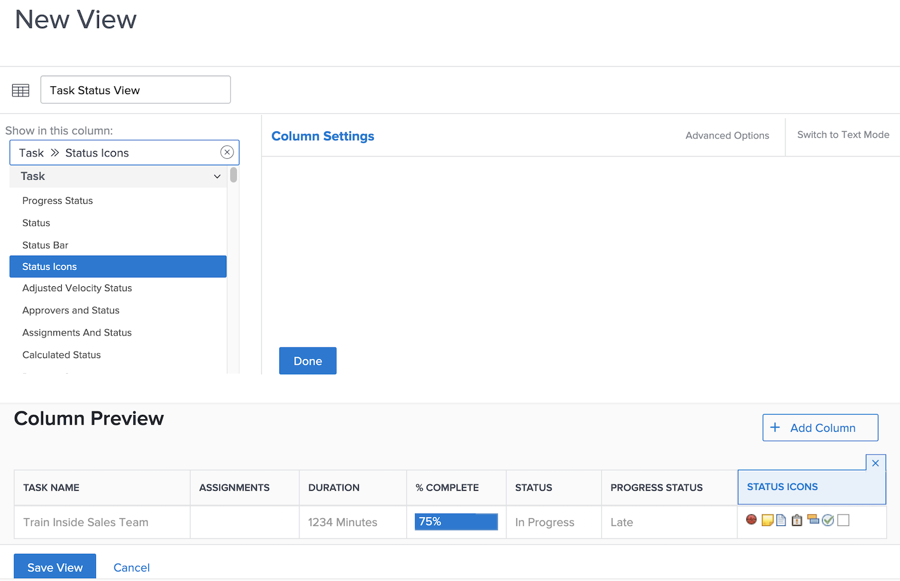
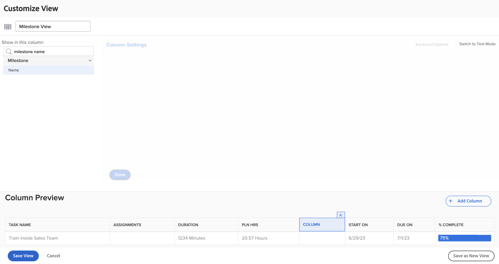
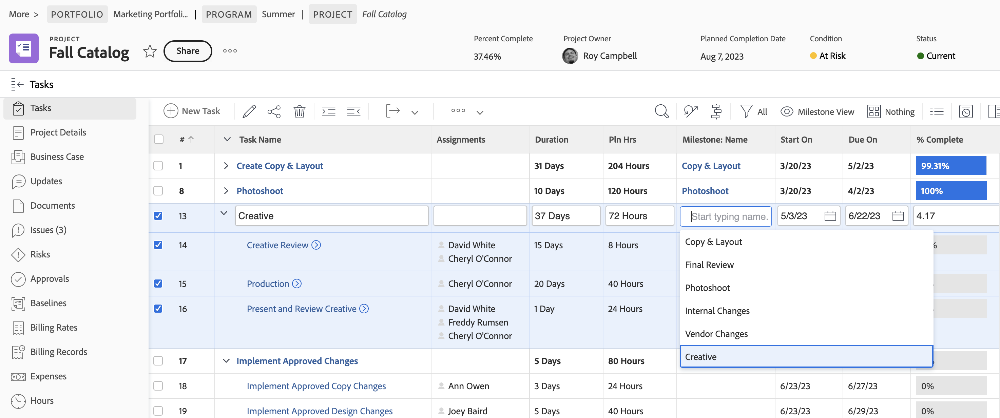
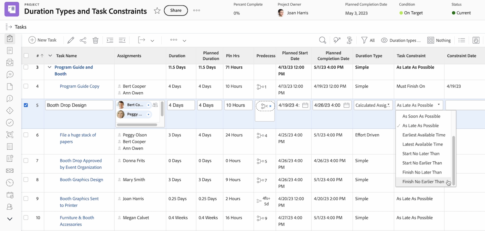

# Create a basic view

In this video, you will learn:

* What a view is in Workfront
* How to create and modify a view
* How to share a view with other Workfront users

>[!VIDEO](https://video.tv.adobe.com/v/335148/?quality=12&learn=on)

## Create basic view activities

[Click here](/help/assets/create-basic-view-activities.pdf) to download a PDF of this page.

### Activity 1: Create a task status view

As a project manager, team lead, or resource manager, you want to keep track of how task work is progressing. With this view, you get several status indicators of a task all in one row of the list or report.

Create a task view named "Task Status View" with the following columns:

* [!UICONTROL Task Name]
* [!UICONTROL Assignments]
* [!UICONTROL Duration]
* [!UICONTROL Percent Complete]
* [!UICONTROL Status]
* [!UICONTROL Progress Status]
* [!UICONTROL Status Icons]

### Answer 1

1. In a task list report, go to the **[!UICONTROL View]** drop-down menu and select **[!UICONTROL New View]**.
1. Name your view "Task Status View."
1. Remove these columns: [!UICONTROL Pln Hrs], [!UICONTROL Predecessors], [!UICONTROL Start On], and [!UICONTROL Due On].
1. Click **[!UICONTROL Add Column]**.
1. In the [!UICONTROL Show in this column] field, type "status" then select "Status" under the [!UICONTROL Task] field source.
1. Click **[!UICONTROL Add Column]** again.
1. In the [!UICONTROL Show in this column] field, type "status" then select "Progress Status" under the [!UICONTROL Task] field source.
1. Click **[!UICONTROL Add Column]** again.
1. In the [!UICONTROL Show in this column] field, type "status" then select "Status Icons" under the Task field source.
1. Click **[!UICONTROL Save]**.

Hover over each of the icons in the [!UICONTROL Status Icons] column to see what they represent. If they are grayed out, it means the task has no notes, documents, approval processes, etc. If an icon appears in color, there is at least one of that item associated with the task. You can click on the note or document icons to go to that item.

### Activity 2: Create a milestone view

If you use milestones, this view is the easiest way to see milestones by name and add or edit them using in-line edit.

Create a task view named "Milestone View" with the following columns:

* [!UICONTROL Task Name]
* [!UICONTROL Assignments]
* [!UICONTROL Duration]
* [!UICONTROL Pln Hrs]
* [!UICONTROL Milestone: Name]
* [!UICONTROL Start On]
* [!UICONTROL Due On]
* [!UICONTROL Percent Complete]

### Answer 2

1. In a project task list, go to the **[!UICONTROL View]** drop-down menu and select **[!UICONTROL New View]**.
1. Name your view "Milestone View."
1. Click on the [!UICONTROL Predecessors] column to select it.
1. In the [!UICONTROL Show in this column] field, click on the X icon in the [!UICONTROL Task >> Predecessors] field, then type "[!UICONTROL milestone name]" and click on "[!UICONTROL Name]" in the list.
1. Click **[!UICONTROL Save]**.

### Activity 3: Create a duration types and task constraints view

This view will allow you to examine and edit all the durations types and task constraints in your project.

Create a task view named "Duration types and task constraints view" with the following columns:

* [!UICONTROL Task Name]
* [!UICONTROL Assignments]
* [!UICONTROL Duration]
* [!UICONTROL Planned Duration]
* [!UICONTROL Pln Hrs]
* [!UICONTROL Predecessors]
* [!UICONTROL Start On]
* [!UICONTROL Due On]
* [!UICONTROL Duration Type]
* [!UICONTROL Task Constraint]
* [!UICONTROL Constraint Date]

Change the [!UICONTROL Field Format] on the [!UICONTROL Start On] and [!UICONTROL Due On] columns to display both the date and the time.

### Answer 3

1. In a project task list, go to the **[!UICONTROL View]** drop-down menu and select **[!UICONTROL New View]**.
1. Name your view "Duration types and task constraints view."
1. Remove the [!UICONTROL % Complete] column.
1. Click **[!UICONTROL Add Column]**.
1. In the [!UICONTROL Show in this column] field, type [!UICONTROL "duration"] then select [!UICONTROL "Planned Duration"] under the [!UICONTROL Task] field source.
1. Move this column between the [!UICONTROL Duration] and the [!UICONTROL Pln Hrs] columns.
1. Click **[!UICONTROL Add Column]** again.
1. In the [!UICONTROL Show in this column] field, type [!UICONTROL "duration type"] then select [!UICONTROL "Duration Type"] under the [!UICONTROL Task] field source.
1. Click **[!UICONTROL Add Column]** again.
1. In the [!UICONTROL Show in this column] field, type [!UICONTROL "constraint"] then select [!UICONTROL "Task Constraint"] under the Task field source.
1. Click **[!UICONTROL Add Column]** again.
1. In the [!UICONTROL Show in this column] field, type [!UICONTROL "constraint"] then select [!UICONTROL "Constraint Date"] under the Task field source.
1. Select the [!UICONTROL Start On] column, then click on [!UICONTROL Advanced Options].
1. Under the [!UICONTROL Field Format] drop down select [!UICONTROL "10/17/60 3:00 AM"].
1. Select the [!UICONTROL Due On] column, then click on [!UICONTROL Advanced Options].
1. Under the [!UICONTROL Field Format] drop down select [!UICONTROL "10/17/60 3:00 AM"].
1. Click **[!UICONTROL Save]**.

### Activity 4: Create a project template active status view

Anyone who manages project templates will appreciate seeing the active status (True or False) of each template in a list. Even better - the field is in-line editable!

Create a project template view named "Standard+active status" with the following columns:

* [!UICONTROL Name]
* [!UICONTROL Owner]
* [!UICONTROL Duration]
* [!UICONTROL Planned Hours]
* [!UICONTROL Planned Cost]
* [!UICONTROL Flags]
* [!UICONTROL Group Name]
* [!UICONTROL Is Active]

### Answer 4

1. In a project template list, go to the **[!UICONTROL View]** drop-down menu and select **[!UICONTROL New View]**.
1. Name your view "Standard+active status."
1. Click **[!UICONTROL Add Column]**.
1. In the [!UICONTROL Show in this column] field, type "is " then select "Is Active" under the [!UICONTROL Template] field source.
1. Click **[!UICONTROL Save View]**.
