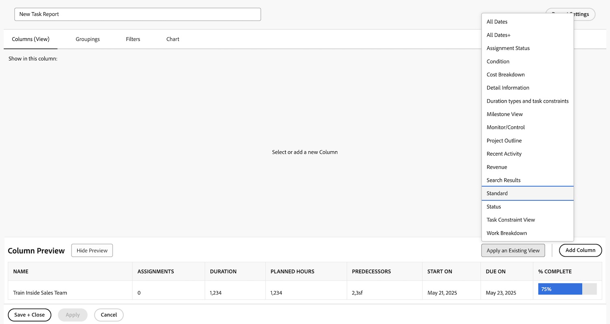
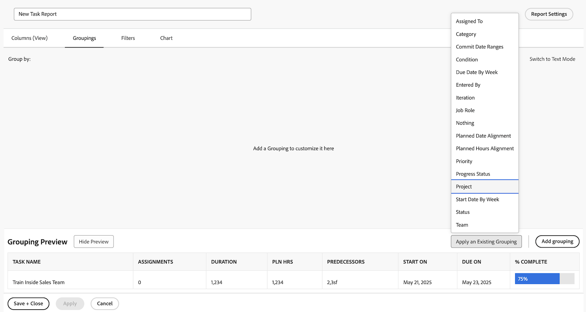
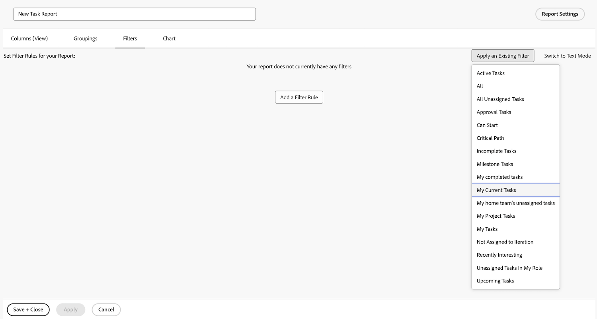
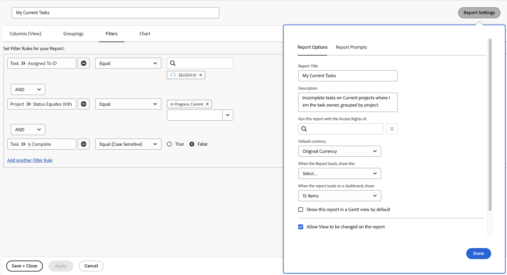

# Create a simple report

This video explains how to create and customize project reports to effectively analyze data. ​ It begins by highlighting the importance of reports in tracking project progress, task completion, budget adherence, and identifying issues. The video demonstrates how to start with a project list report, adjust filters, views, and groupings, and create a custom report for convenience. ​ ​

The video emphasizes that custom reports retain their default settings, but temporary changes can be made when viewing them. ​ Reports are stored in the "My Reports" section, while shared reports appear in "Shared with Me." ​ Frequently used reports can be pinned or marked as favorites for easy access. ​

>[!VIDEO](https://video.tv.adobe.com/v/335153/?quality=12&learn=on&enablevpops=0)

## Key takeaways

* **Purpose of Reports:** Reports help track project progress, task completion, budget adherence, and identify issues, making them essential for effective project management.
* **Custom Report Creation:** Custom reports allow you to save specific filters, views, and groupings for easy access, eliminating the need to repeatedly adjust settings. ​
* **Steps to Build a Report:** Select the appropriate object type, name the report, apply filters, views, and groupings, customize columns, and save the report. ​
* **Temporary vs.​ Default Settings:** While viewers can temporarily change filters, views, and groupings, the report will always revert to its default settings upon reopening. ​
* **Organizing Reports:** Custom reports are stored in "My Reports," shared reports in "Shared with Me," and frequently used reports can be pinned or marked as favorites for quick access. ​

## "Create a simple report" activities

### Activity 1: Create a simple task report

You want to track all of your active tasks in a single report. Create a Task report named "My Current Tasks" using the following:

* Columns (View) = Standard
* Groupings = Project
* Filter = My Current Tasks
* Description = Incomplete tasks on Current projects where I am the task owner, grouped by project.

### Answer 1

1. Go to the **[!UICONTROL Main Menu]** and select **[!UICONTROL Reports]**.
1. Click the **[!UICONTROL New Report]** drop-down menu and select **[!UICONTROL Task Report]**.
1. In [!UICONTROL Columns (View)], click the **[!UICONTROL Apply an Existing View]** menu and select **[!UICONTROL Standard]**.

   

1. In the **[!UICONTROL Groupings]** tab, click the **[!UICONTROL Apply an Existing Grouping]** menu and select **[!UICONTROL Project]**.

   

1. In the **[!UICONTROL Filters]** tab, click the **[!UICONTROL Apply an Existing Filter]** menu and select My Current Tasks.

   

1. Open **[!UICONTROL Report Settings]** and name the report "My Current Tasks."
1. In the Description field, enter "Incomplete
tasks on Current projects where I am the task
owner, grouped by project."

   

1. Save and Close your report.
