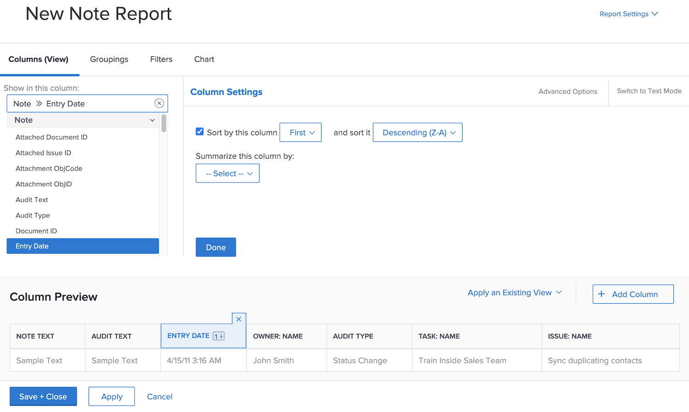
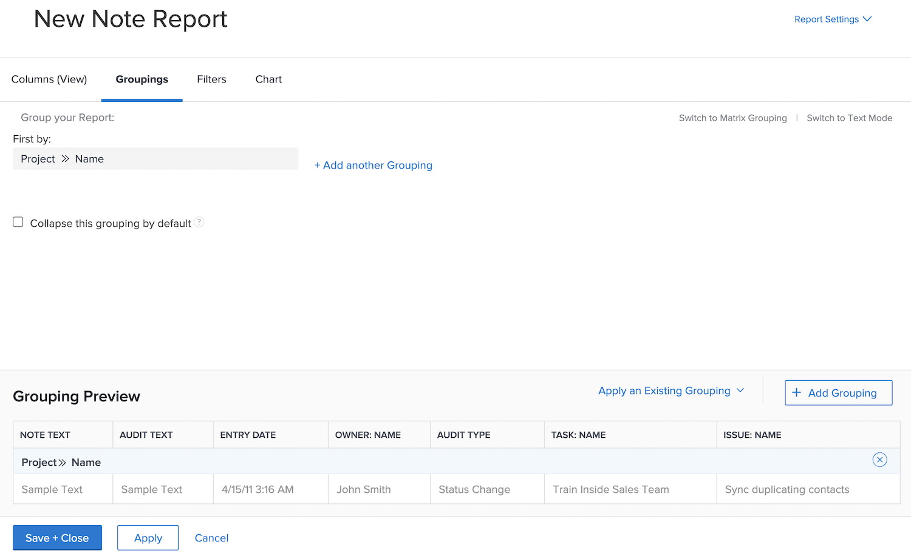
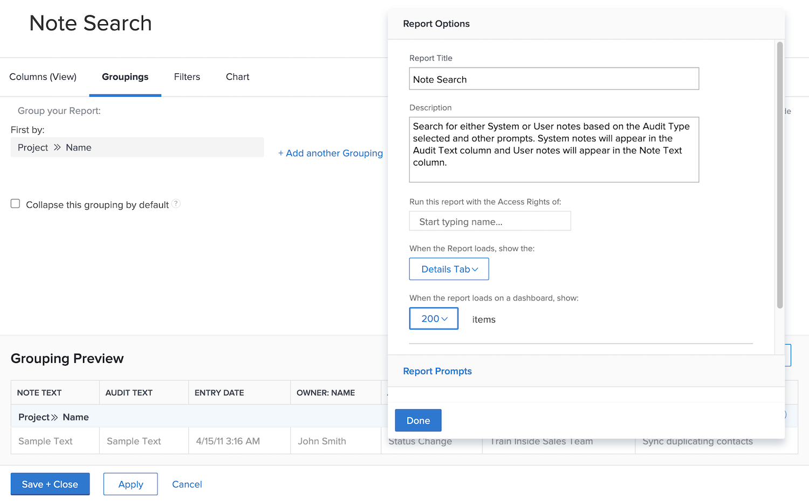
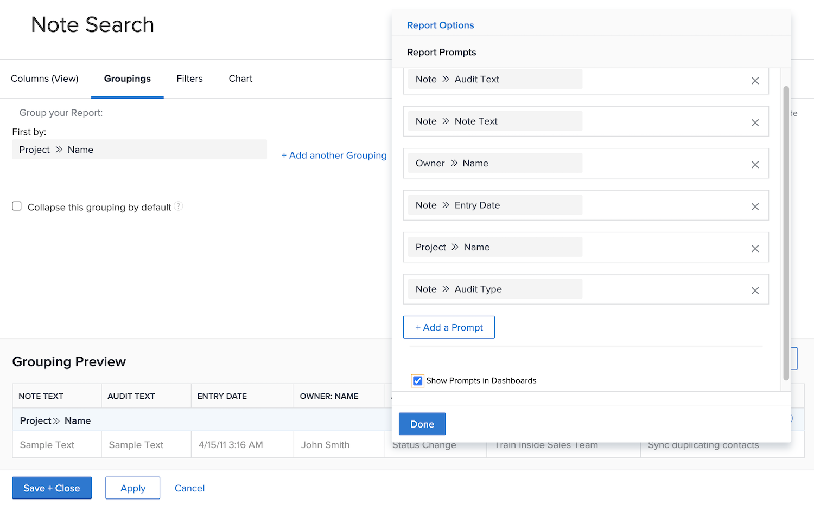
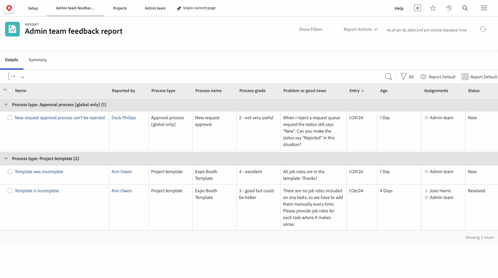
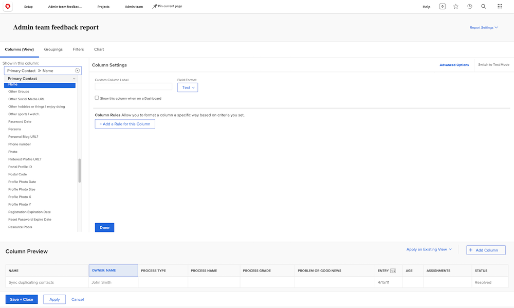
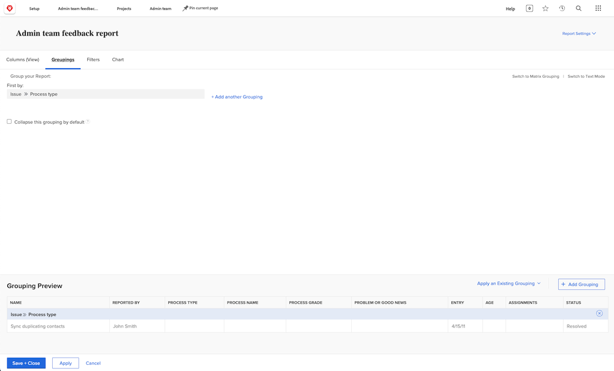
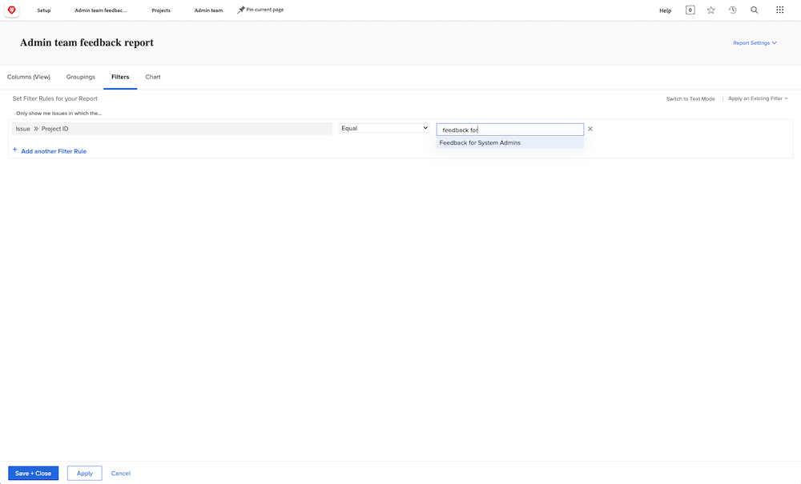

# Create a task report

In this video, you will learn:

* How to create a task report with a complex filter
* How to find the reports you create

>[!VIDEO](https://video.tv.adobe.com/v/335154/?quality=12&learn=on)

>[!TIP]
>
>Break out your spatulas and mixing bowls and get ready to try the "recipes" in our [Adobe Workfront Customer Reporting Cookbook](/help/assets/workfront-customer-reporting-cookbook.pdf). Inside you'll find step-by-step instructions for 10 reports, ready for you to whip up in your environment today.
> 
>We've gathered favorite reports from customers and put them together in a snackable, easily digestible, cookbook for you to take back and test out in your own Workfront kitchen.
> 
>These 10 reports come from customers who are just like you. Spread out across industries, departments, teams, positions and all in different companies, we owe a huge thank you to the incredible customers who shared one of their favorite reports. Some reports are simple (but incredibly useful), and some are more complex to take your reporting to the next level.

## Activity 1: Create a note report with prompts

Create a Note report that you can use to search for user notes (i.e., comments or updates) or system notes based on the note content, the author, entry date, project name, or audit type. Name the report "Note Search."

When using the Note Text prompt, this report will search within update threads to quickly extract any that meet the criteria specified in the prompts. When you run the report, you don't need to fill in every prompt, just the ones you care about. The blank ones are automatically ignored.

The view should include columns for:

* Note Text
* Audit Text
* Entry Date
* Owner: Name
* Audit Type
* Task Name
* Issue Name

Leave the filter tab blank.

Group on Project Name.

Include prompts for the following:

* Audit Text
* Note Text
* Owner Name
* Entry Date
* Project Name
* Audit Type

## Activity 1 Answer

1. Select **[!UICONTROL Reports]** from the **[!UICONTROL Main Menu]**.
1. Click the **[!UICONTROL New Report]** menu and select **[!UICONTROL Note]**.
1. In **[!UICONTROL Columns (View)]** set up your columns to include:

   

   * [!UICONTROL Note] > [!UICONTROL Note Text]
   * [!UICONTROL Note] > [!UICONTROL Audit Text]
   * [!UICONTROL Note] > [!UICONTROL Entry Date]
   * [!UICONTROL Owner] > [!UICONTROL Name]
   * [!UICONTROL Note] > [!UICONTROL Audit Type]
   * [!UICONTROL Task] > [!UICONTROL Name]
   * [!UICONTROL Issue] > [!UICONTROL Name]

1. Select the **[!UICONTROL Entry Date]** column and change the **[!UICONTROL Sort to Descending]**.
1. In the **[!UICONTROL Groupings]** tab, set the report to group by [!UICONTROL Project] > [!UICONTROL Name].

   

1. Leave [!UICONTROL Filters] blank.
1. Open **[!UICONTROL Report Settings]** and name the report "Note Search."
1. In the [!UICONTROL Description] field, put something like, "Search for System or User notes based on the Audit Type selected and other prompts. System notes appear in the Audit Text column and User notes appear in the Note Text column."

   

1. Select **[!UICONTROL Details Tab]** so that it displays when the report loads.
1. Set the report to show 200 items when the report is included on a dashboard.
1. Click **[!UICONTROL Report Prompts]** and add:

   

   * [!UICONTROL Note] > [!UICONTROL Audit Text]
   * [!UICONTROL Note] > [!UICONTROL Note Text]
   * [!UICONTROL Owner] > [!UICONTROL Name]
   * [!UICONTROL Note] > [!UICONTROL Entry Date]
   * [!UICONTROL Project] > [!UICONTROL Name]
   * [!UICONTROL Note] > [!UICONTROL Audit Type]

1. Check the box for **[!UICONTROL Show Prompts in Dashboards]**.
1. Save and Close your report.

## Activity 2: Create an admin team feedback report

This is an issue report that displays all the issues from a feedback request queue created for system admins. You can see how to create this request queue in the [Create a system admin feedback request queue](https://experienceleague.adobe.com/docs/workfront-learn/tutorials-workfront/manage-work/request-queues/create-a-system-admin-feedback-request-queue.html) tutorial.

This report also uses a custom form. To learn how to create a custom form, see the [Create and share a custom form](https://experienceleague.adobe.com/docs/workfront-learn/tutorials-workfront/custom-data/custom-forms/custom-forms-creating-and-sharing-a-custom-form.html) tutorial.

This custom form should be created as follows:

Name: Admin process feedback

1. Process type (dropdown field)
   * access levels
   * approval process (global only)
   * email notifications
   * layout template
   * milestone path
   * project template
   * reminder notifications
   * request queue
1. Process name (single line text field)
1. Process grade (dropdown field)
   * 1 - totally useless
   * 2 - not very useful
   * 3 - good but could be better
   * 4 - excellent
1. Problem or good news (paragraph text field)

Create an issue report named **Admin team feedback report**.

The view should have the following columns:

* Issue: Name
* Primary Contact: Name
* Issue: Process type
* Issue: Process name
* Issue: Process grade
* Issue: Problem or good news
* Issue: Entry date
* Issue: Age
* Issue: Assignments
* Issue: Status

Group on Process type.

Filter on the ID of the request queue project where the feedback issues reside.

   

## Activity 2 Answer

1. Select **[!UICONTROL Reports]** from the **[!UICONTROL Main Menu]**.
1. Click the **[!UICONTROL New Report]** menu and select **[!UICONTROL Issue]**.
1. In **[!UICONTROL Columns (View)]** set up your columns to include:

   

   * [!UICONTROL Issue] > [!UICONTROL Name]
   * [!UICONTROL Primary Contact] > [!UICONTROL Name] 
      * Note: this appears with "Owner:Name" as the column label. You can change this to "Reported by" by clicking on Advanced Options and typing "Reported by" in the **Custom Column Label** field.
   * [!UICONTROL Issue] > [!UICONTROL Process type]
   * [!UICONTROL Issue] > [!UICONTROL Process name]
   * [!UICONTROL Issue] > [!UICONTROL Process grade]
   * [!UICONTROL Issue] > [!UICONTROL Problem or good news]
   * [!UICONTROL Issue] > [!UICONTROL Entry date]
   * [!UICONTROL Issue] > [!UICONTROL Age]
   * [!UICONTROL Issue] > [!UICONTROL Assignments]
   * [!UICONTROL Issue] > [!UICONTROL Status]

1. Select the **[!UICONTROL Entry Date]** column and change the **[!UICONTROL Sort to Descending]**.
1. In the **[!UICONTROL Groupings]** tab, set the report to group by **[!UICONTROL Issue] > [!UICONTROL Process type]**.

   

1. In the **[!UICONTROL Filters]** tab, add a filter for the **[!UICONTROL Issue] > [!UICONTROL Project ID]** to equal the request queue project where the feedback issues reside.

   

1. Save and Close your report.
