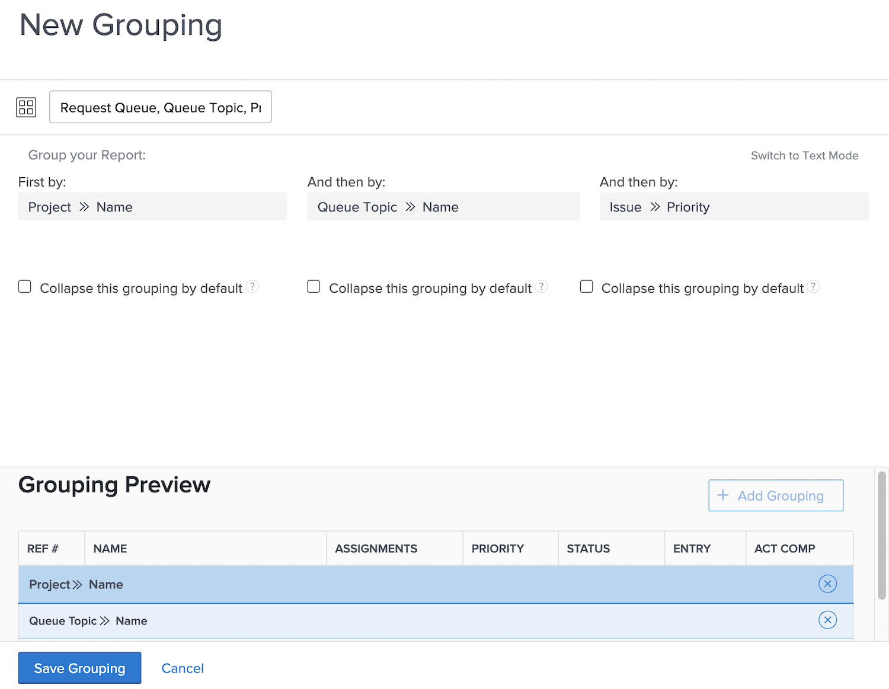

# Activity: Create a basic grouping

Create an issue grouping that will be used in a report to track requests that come through a request queue. This grouping will make it easy to see similar types of issues/requests grouped by their priority. Name the grouping "Request Queue, Queue Topic, Priority."

Group the issue report based on:

1. The name of the request queue (this will be the project name)
1. The queue topic
1. The priority of the request

## Answer

1. In an issue list report, go to the **[!UICONTROL Grouping]** menu and select **[!UICONTROL New Grouping]**.
1. Name your grouping "Request Queue, Queue Topic, Priority."
1. Click **[!UICONTROL Add Grouping]**.
1. In the [!UICONTROL First By] field. type "project name" then select **[!UICONTROL Name]** under the Project field source.
1. Click **[!UICONTROL Add another Grouping]**.
1. In the [!UICONTROL And then by] field, type "queue" then select **[!UICONTROL Name]** under the [!UICONTROL Queue Topic] field source.
1. Click **[!UICONTROL Add another Grouping]**.
1. In the [!UICONTROL And then by] field, type "priority" then select **[!UICONTROL Priority]** under the [!UICONTROL Issue] field source.
1. Click **[!UICONTROL Save Grouping]**
