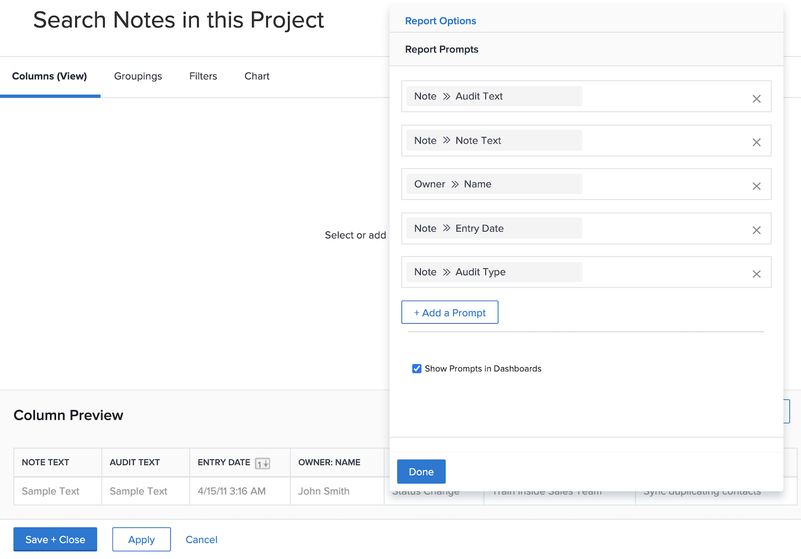
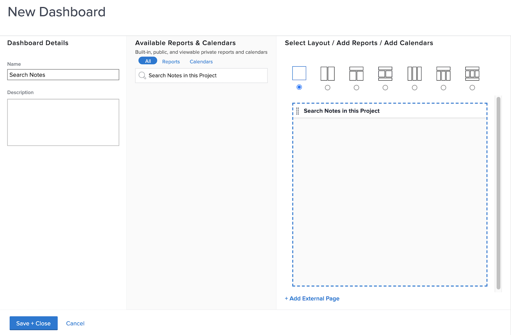
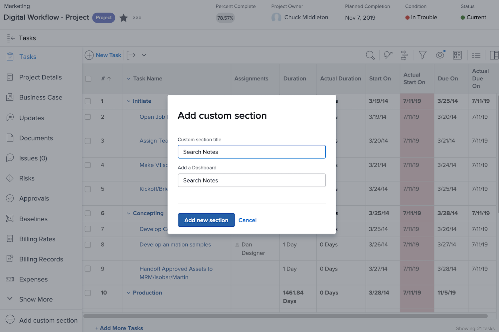

# Create dashboards

The video covers the following key points:

* **Introduction to Dashboards:** Explains what a dashboard is in Workfront and its purpose as a collection of related reports. ​
* **Creating a Dashboard:** Guides on how to create a new dashboard by navigating to the Dashboards area, selecting "New Dashboard," naming it, and choosing a layout. ​
* **Adding Reports:** Demonstrates how to add various reports to the dashboard, such as project reports, task reports, and issue reports, and arranging them within the chosen layout. ​
* **Customizing Views:** Shows how to customize which columns are displayed in the dashboard view by editing the report and selecting specific columns to show. ​
* **Adding Additional Elements:** Explains how to add a custom calendar and an external page (e.g., an online document) to the dashboard. ​
* **Saving and Pinning:** Instructs on saving the dashboard and pinning it for easy access. ​
* **Viewing and Editing:** Provides tips on viewing and editing the dashboard, including adjusting column visibility for better display. ​
* **Finding and Sharing Dashboards:** Describes how to find dashboards via the main menu, add them to favorites, and share them with other users. ​
* **Printing Dashboards:** Explains the process of printing a dashboard. ​

>[!VIDEO](https://video.tv.adobe.com/v/335157/?quality=12&learn=on)

## "Create dashboard" activities

### Activity 1: Create a dashboard

Create a [!UICONTROL dashboard] with only one report in it—"Search Notes in This Project." This is useful for quickly finding any update made on a project, even if there are thousands of updates to search through. This will search into update threads to quickly extract any updates that meet the criteria you specify in the prompts.

Create this report by making a copy of the "Search Notes" report you created in the "Create a note report" activity (or use another report if you didn't do that activity).

* Remove the Project Name prompt from the copy and rename the report "Search Notes in This Project."
* Name the [!UICONTROL Dashboard] "Search Notes."
* Go to any project landing page and create a custom section for a [!UICONTROL dashboard].
* Note that when you search for notes in your custom section it will only show notes contained within the project you're currently in.

### Answer 1

1. Run the report you created in the "Create a note report" activity.
1. Click **[!UICONTROL Report Actions]** and select **[!UICONTROL Copy]**. [!DNL Workfront] creates a new report named "Note Search (Copy)."
1. Go to **[!UICONTROL Report Actions]** and select **[!UICONTROL Edit]**. Click **[!UICONTROL Report Settings]** and change the name to "Search Notes in This Project."
1. Click [!UICONTROL Report Prompts] and delete the [!UICONTROL Project] > [!UICONTROL Name] prompt from the list.

   

1. Check the **[!UICONTROL Show Prompts in Dashboard]** box.
1. Click **[!UICONTROL Done]**, then **[!UICONTROL Save + Close]**. You now are looking at the [!UICONTROL Prompts] screen of the report.

   Next you're going to use a shortcut to create a new dashboard and add this report to it.

1. Click **[!UICONTROL Report Actions]** and select **[!UICONTROL Add to Dashboard]** > **[!UICONTROL New Dashboard]**.
1. Drag the report "Search Notes in This Project" to the **[!UICONTROL Layout]** panel.
1. Notice that the name of the report becomes the name of the dashboard. Edit the name to just "Search Notes."

   

1. Click **[!UICONTROL Save + Close]**.

   Now add the dashboard to a project page.

   

1. Go to any project. From the left panel menu, click the **[!UICONTROL Add custom section]** icon.
1. In the **[!UICONTROL Add a Dashboard]** field, type "Search Notes" and select the [!UICONTROL dashboard] from the list.
1. In the **[!UICONTROL Custom section title]** field, type in "Search Notes."
1. Click **[!UICONTROL Add new section]**.
1. From the left panel menu, find Search Notes. Click the dots to the left of the section name and drag it right below Updates.
