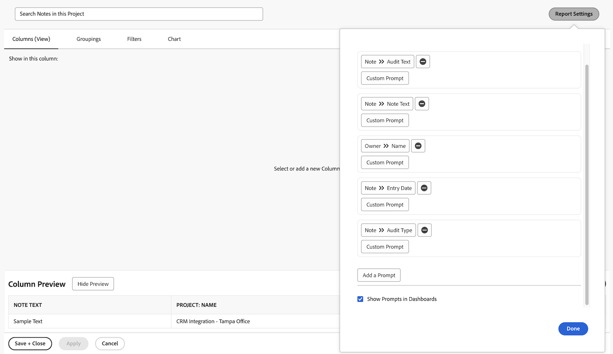
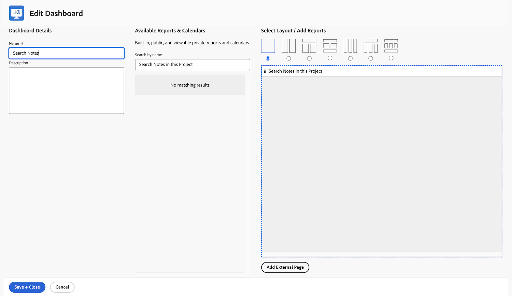
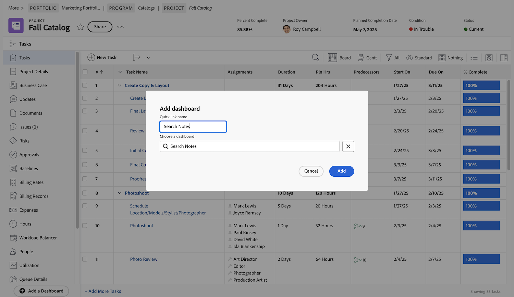
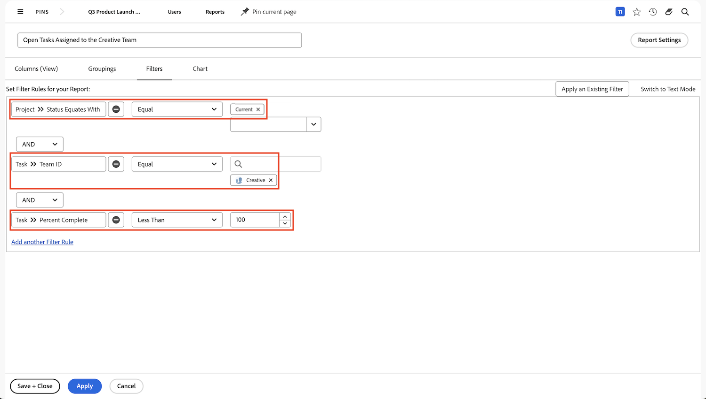
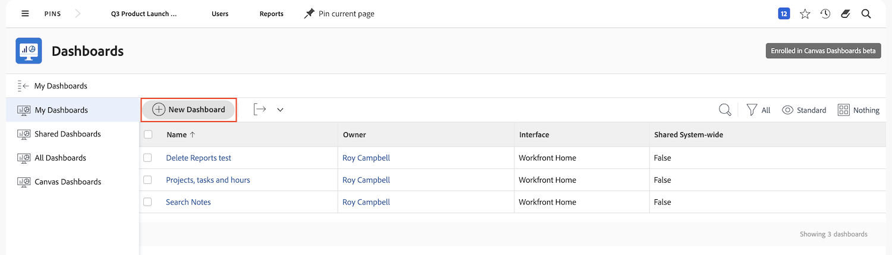
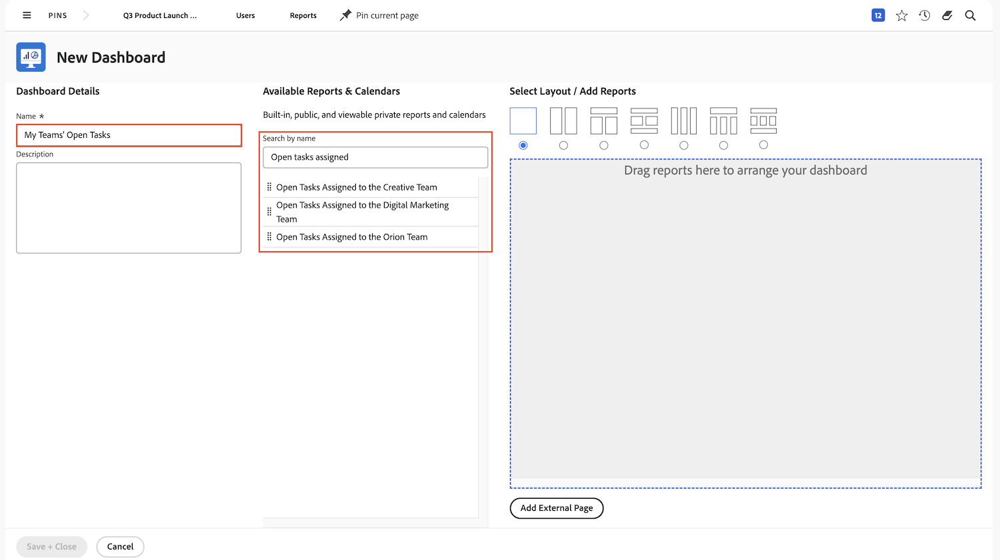

# Create dashboards in Workfront

The video provides a comprehensive guide to understanding and using dashboards in Workfront. 
​It explains that a dashboard is a collection of reports that allows users to organize and display related data in one place. 

>[!VIDEO](https://video.tv.adobe.com/v/335157/?quality=12&learn=on&enablevpops=0)

## Key takeaways

* **Dashboards in Workfront:** A dashboard is a collection of reports that allows users to organize and display related data, such as projects, tasks, and issues, in one centralized view. ​
* **Creating Dashboards:** Dashboards can be customized by selecting a layout, adding reports, custom calendars, or external pages, and arranging them for optimal display. ​ Users can also customize which columns appear in side-by-side reports within the dashboard. ​
* **Accessing Dashboards:** Dashboards can be found under "My Dashboards," "Shared Dashboards," or "All Dashboards" in the Dashboards area. ​ Frequently used dashboards can be pinned or added to favorites for quick access. ​
* **Sharing Dashboards:** Dashboards can be shared with other Workfront users, including all reports within the dashboard, via the "Dashboard Actions" menu. ​
* **Printing Dashboards:** Dashboards can be printed directly from the "Dashboard Actions" menu, making it easy to share physical copies of the data. ​

## "Create dashboard" activities

### Activity 1: Create a dashboard

Create a [!UICONTROL dashboard] with only one report in it—"Search Notes in This Project." This is useful for quickly finding any update made on a project, even if there are thousands of updates to search through. This will search into update threads to quickly extract any updates that meet the criteria you specify in the prompts.

Create this report by making a copy of the "Search Notes" report you created in the "Create a note report" activity. Didn't create it yet? Click here to see the activity in the [Create a task report](https://experienceleague.adobe.com/en/docs/workfront-learn/tutorials-workfront/reporting/basic-reporting/create-a-task-report#activity-1-create-a-note-report-with-prompts) tutorial.

* Remove the Project Name prompt from the copy and rename the report "Search Notes in This Project."
* Name the [!UICONTROL Dashboard] "Search Notes."
* Go to any project landing page and create a custom section for a [!UICONTROL dashboard].
* Note that when you search for notes in your custom section it will only show notes contained within the project you're currently in.

### Answer 1

1. Run the report you created in the "Create a note report" activity. Didn't create it yet? Click here to see the activity in the [Create a task report](https://experienceleague.adobe.com/en/docs/workfront-learn/tutorials-workfront/reporting/basic-reporting/create-a-task-report#activity-1-create-a-note-report-with-prompts) tutorial.
1. Click **[!UICONTROL Report Actions]** and select **[!UICONTROL Copy]**. [!DNL Workfront] creates a new report named "Note Search (Copy)."
1. Go to **[!UICONTROL Report Actions]** and select **[!UICONTROL Edit]**. Click **[!UICONTROL Report Settings]** and change the name to "Search Notes in This Project."
1. Click [!UICONTROL Report Prompts] and delete the [!UICONTROL Project] > [!UICONTROL Name] prompt from the list.

   

1. Check the **[!UICONTROL Show Prompts in Dashboard]** box.
1. Click **[!UICONTROL Done]**, then **[!UICONTROL Save + Close]**. You now are looking at the [!UICONTROL Prompts] screen of the report.

   Next you're going to use a shortcut to create a new dashboard and add this report to it.

1. Click **[!UICONTROL Report Actions]** and select **[!UICONTROL Add to Classic Dashboard]** > **[!UICONTROL New Dashboard]**.
1. Drag the report "Search Notes in This Project" to the **[!UICONTROL Layout]** panel.
1. Notice that the name of the report becomes the name of the dashboard. Edit the name to just "Search Notes."

   

1. Click **[!UICONTROL Save + Close]**.

   Now add the dashboard to a project page.

   

1. Go to any project. From the left panel menu, click the **[!UICONTROL Add a Dashboard]** button.
1. In the **[!UICONTROL Choose a dashboard]** field, type "Search Notes" and select the [!UICONTROL dashboard] from the list.
1. In the **[!UICONTROL Quick link name]** field, type in "Search Notes."
1. Click **[!UICONTROL Add]**.
1. From the left panel menu, find Search Notes near the bottom. Click the dots to the left of the name and drag it up to right below Updates.

### Activity 2: My Teams' Open Tasks

Create a [!UICONTROL dashboard] with 3 "open task" reports in it, each filtered by a different team assigned to the tasks. 

Use an existing "open task" report--filtered by a team--if you have one, or create a new one for this dashboard. Copy and edit the report twice for two additional teams, then put them on a single dashboard named **"My Teams' Open Tasks."**

### Answer 2

#### Part 1 - Create an "open tasks" report filtered by one of your teams

1. Select **[!UICONTROL Reports]** from the **[!UICONTROL Main Menu]**.
1. Click the **[!UICONTROL New Report]** menu and select **[!UICONTROL Task]**.
1. Name your report "Open Tasks Assigned to the Creative Team" (or any other of your teams).
1. In **[!UICONTROL Columns (View)]** set up your columns to include:

   

   * [!UICONTROL Project] > [!UICONTROL Name]
   * [!UICONTROL Task] > [!UICONTROL Name] 
   * [!UICONTROL Task] > [!UICONTROL Assignments]
   * [!UICONTROL Task] > [!UICONTROL Duration]
   * [!UICONTROL Task] > [!UICONTROL Planned Hours]
   * [!UICONTROL Task] > [!UICONTROL Planned Start Date]
   * [!UICONTROL Task] > [!UICONTROL Planned Completion Date]
   * [!UICONTROL Task] > [!UICONTROL Percent Complete]

1. Select the **[!UICONTROL Planned Completion Date]** column and change the Sort to **Ascending**.

1. In the **[!UICONTROL Filters]** tab, add filter rules to include:

   

   * [!UICONTROL Project] > [!UICONTROL Status Equates With] > [!UICONTROL Equal] > "Current"
   * [!UICONTROL Task] > [!UICONTROL Team ID] > [!UICONTROL Equal] > "Creative"
   * [!UICONTROL Task] > [!UICONTROL Percent Complete]  > [!UICONTROL Less Than] > "100"

1. Click the **[!UICONTROL Save+Close]** button to save and close your report.

#### Part 2 - Copy the report you just created and create a new report for your second team

   

1. Viewing the report you just created, click **[!UICONTROL Report Actions] > [!UICONTROL Copy]**.
1. The new report will appear with the name **"(Copy)"** appended in the title. 
1. Click **[!UICONTROL Report Actions] > [!UICONTROL Edit]**. Then change the filter and the report title to focus on the Orion team (or any other of your teams).
1. Click on the [!UICONTROL Filters] tab, then change the filter rule 
**[!UICONTROL Task] > [!UICONTROL Team ID] > [!UICONTROL Equal] > "Creative"** to 
**[!UICONTROL Task] > [!UICONTROL Team ID] > [!UICONTROL Equal] > "Orion"**
1. In the Report Titile field, change the word **[!UICONTROL "Creative"]** to **[!UICONTROL "Orion"]** and delete the word **"(Copy)"**.
1. Click the **[!UICONTROL Save+Close]** button to save and close your report.

#### Part 3 - Copy the report again and create a new report for your third team

1. Viewing the report you just created, click **[!UICONTROL Report Actions] > [!UICONTROL Copy]** again. This time change the name of the team in the title and the filter to "Digital Marketing" (or any other of your teams).

#### Part 4 - Create a dashboard showing the open tasks on each of your teams

1. From the main menu, click on **[!UICONTROL Dashboards]**.
1. Then click on **[!UICONTROL New Dashboard]**.

   

1. Name the dashboard **"My Teams' Open Tasks"**.
1. Start typing the name of your reports in the **[!UICONTROL Search by name]** field.
1. Since your report names all start out with the same words, you might see them all come up like this:

   

1. Drag them each over to the layout area, then click Save + Close.

   

1. Here's the final dashboard:

   
