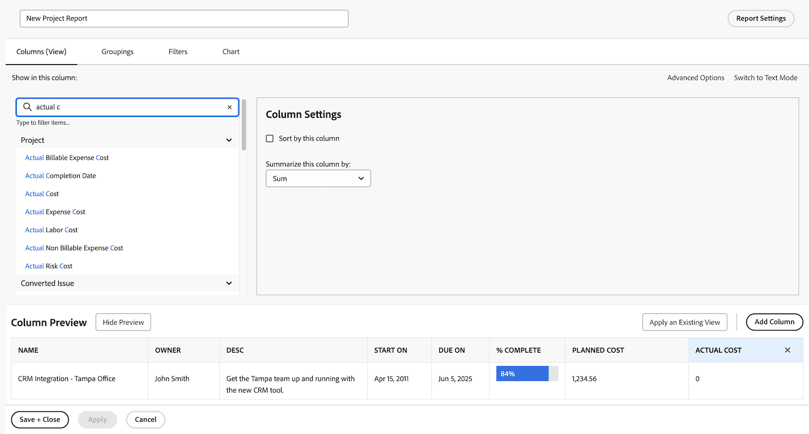
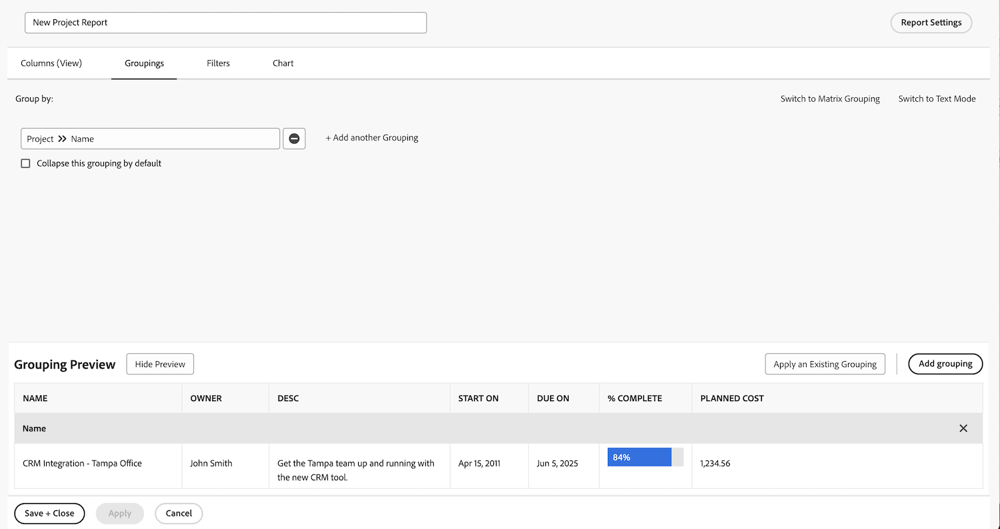
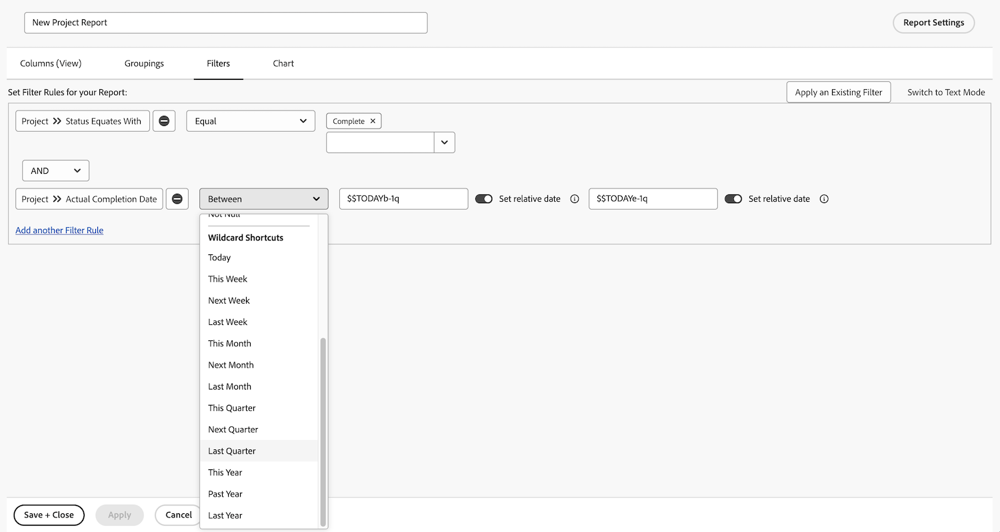
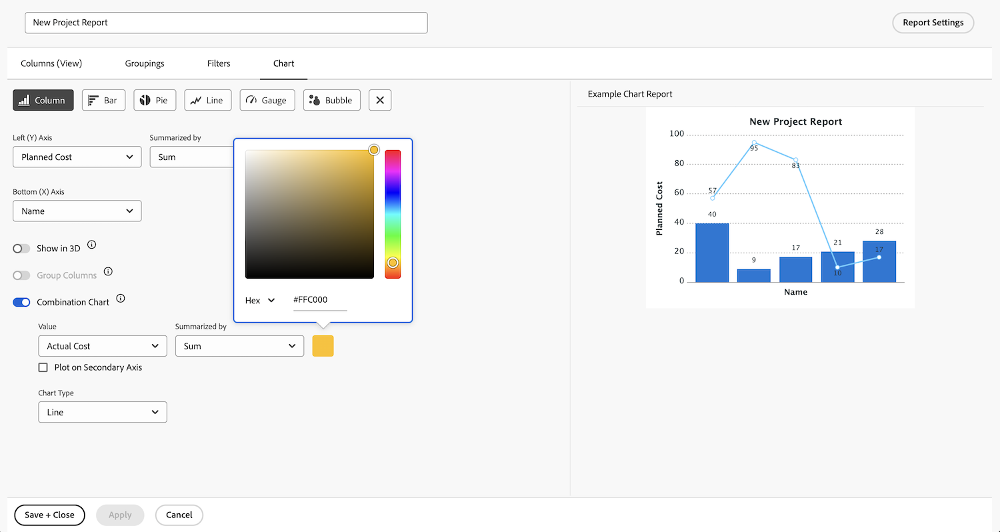

# Visualize data with charts in reports

The video explains how to use charts to visualize data effectively, particularly for tracking project tasks. ​ It demonstrates creating two types of reports in Workfront:

**Late Tasks by Project Report:**

* Start with a list report and apply filters to show only incomplete, late tasks in current projects. ​
* Group tasks by project name and create a pie chart to visualize the distribution of late tasks across projects. ​
* Set the chart as the default tab for easy access. ​

**Tasks by Project and Progress Status Report:**

* Copy the first report and add another grouping for task progress status.
* Remove filters to include all tasks, showing their progress during project execution.
* Use a stacked column chart to display the total number of tasks per project, with stacks representing different progress statuses.
* Customize colors if needed and save the report.

The video highlights how charts like pie and stacked column charts can provide insights into task distribution and project performance, helping users compare projects and understand task progress visually. ​

>[!VIDEO](https://video.tv.adobe.com/v/335155/?quality=12&learn=on&enablevpops=0)

## Key takeaways

* **Charts Enhance Data Clarity**: Visualizing data with charts, such as pie or column charts, makes it easier to understand task distribution and project progress compared to list reports. ​
* **Filtering for Specific Insights**: Applying filters (e.g., incomplete, late tasks in current projects) helps focus on relevant data for targeted analysis. ​
* **Grouping for Better Organization**: Grouping tasks by project name or progress status organizes data effectively, enabling meaningful comparisons across projects. ​
* **Chart Customization Options**: Users can select chart types (e.g., pie, column, bar) and customize colors to align with preferences or branding. ​
* **Stacked Column Charts for Detailed Insights**: Stacked column charts provide a comprehensive view of task progress within projects, showing both total tasks and their statuses in a single visualization.

## "Create reports with charts" activities

### Activity 1: Add a chart to a report

The end of the quarter is nearing, and you want to see how recently completed projects stuck to their budgets. Create a report that shows the planned cost vs. the actual cost for projects. You want to see only projects that were completed in the last quarter. Add a combination column chart using custom colors.

### Answer 1

1. Select **[!UICONTROL Reports]** from the **[!UICONTROL Main Menu]**.
1. Click the **[!UICONTROL New Report]** menu and select **[!UICONTROL Project]**.
1. In the **[!UICONTROL Columns (View)]** tab, click **[!UICONTROL Add Column]**.
1. Select [!UICONTROL Project] > [!UICONTROL Planned Cost] and summarize this column by **[!UICONTROL Sum]**.
1. Click **[!UICONTROL Add Column]** again.
1. Select [!UICONTROL Project] > [!UICONTROL Actual Cost] and summarize this column by **[!UICONTROL Sum]**.

   

1. In the **[!UICONTROL Groupings]** tab, set the report to group by [!UICONTROL Project] > [!UICONTROL Name].

   

1. In the **[!UICONTROL Filters]** tab, add two filter rules:

   * [!UICONTROL Project] > [!UICONTROL Status Equates With] > [!UICONTROL Complete]
   * [!UICONTROL Project] >[!UICONTROL  Actual Completion Date] > [!UICONTROL Last Quarter]

   

1. In the **[!UICONTROL Chart]** tab, choose **[!UICONTROL Column]** for the chart type.
1. For the [!UICONTROL Left (Y) Axis], choose [!UICONTROL Planned Cost].
1. For the [!UICONTROL Bottom (X) Axis], choose [!UICONTROL Name].
1. Click the **[!UICONTROL Combination Chart]** button and select [!UICONTROL Actual Cost] in the **[!UICONTROL Value]** field.
1. In the **[!UICONTROL Chart Type]** field select Line.
1. Click the color box to change the [!UICONTROL Actual Cost] color. Select a color.
1. Click on **[!UICONTROL Save + Close]**. When prompted for a report name, call it "Planned vs Actual Cost by Project Completed Last Quarter."

   
