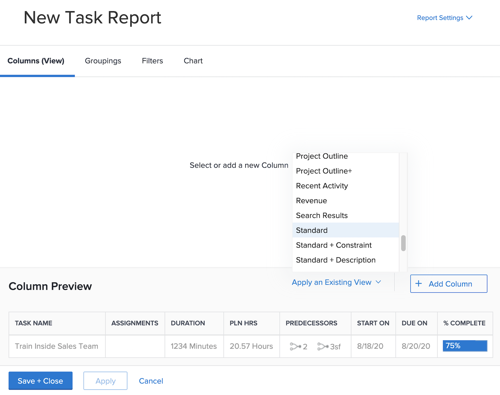
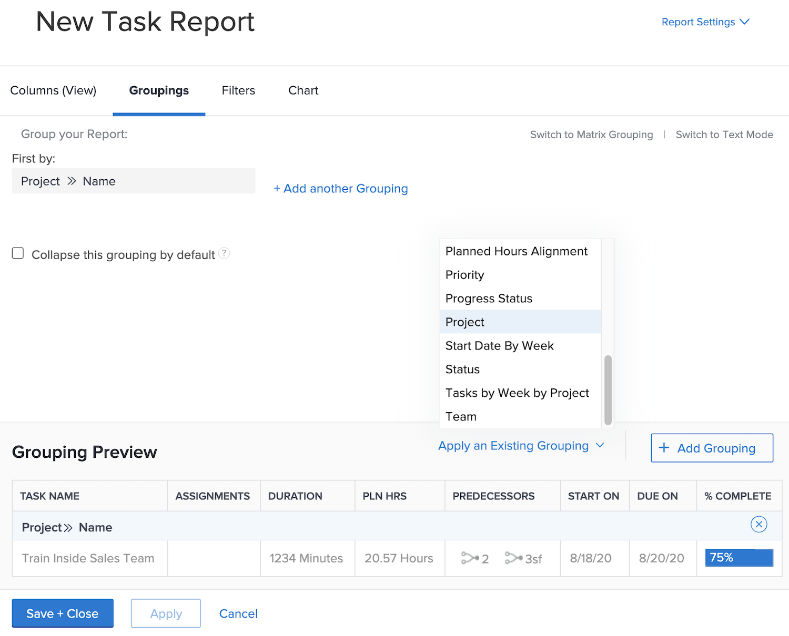
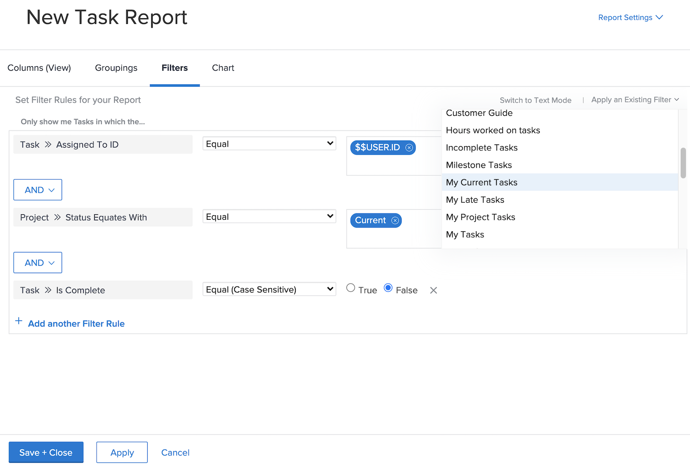
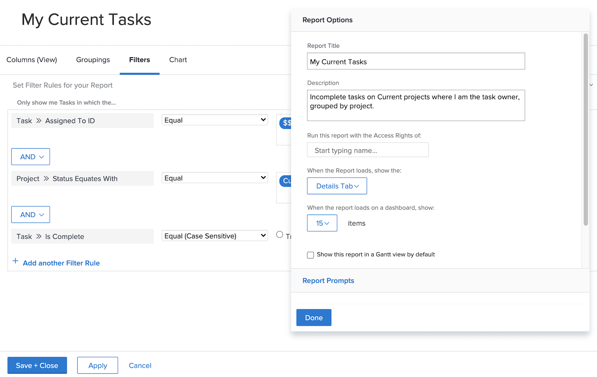

# Create simple report activities

Practice creating simple reports, with step by step instructions.

## Activity 1: Create a simple task report

You want to track all of your active tasks in a single report. Create a Task report named "My Current Tasks" using the following:

* Columns (View) = Standard
* Groupings = Project
* Filter = My Current Tasks
* Description = Incomplete tasks on Current projects where I am the task owner, grouped by project.

## Answer 1

1. Go to the **[!UICONTROL Main Menu]** and select **[!UICONTROL Reports]**.
1. Click the **[!UICONTROL New Report]** drop-down menu and select **[!UICONTROL Task Report]**.
1. In [!UICONTROL Columns (View)], click the **[!UICONTROL Apply an Existing View]** menu and select **[!UICONTROL Standard]**.

   

1. In the **[!UICONTROL Groupings]** tab, click the **[!UICONTROL Apply an Existing Grouping]** menu and select **[!UICONTROL Project]**.

   

1. In the **[!UICONTROL Filters]** tab, click the **[!UICONTROL Apply an Existing Filter]** menu and select My Current Tasks.

   

1. Open **[!UICONTROL Report Settings]** and name the report "My Current Tasks."
1. In the Description field, enter "Incomplete
tasks on Current projects where I am the task
owner, grouped by project."

   

1. Save and Close your report.
