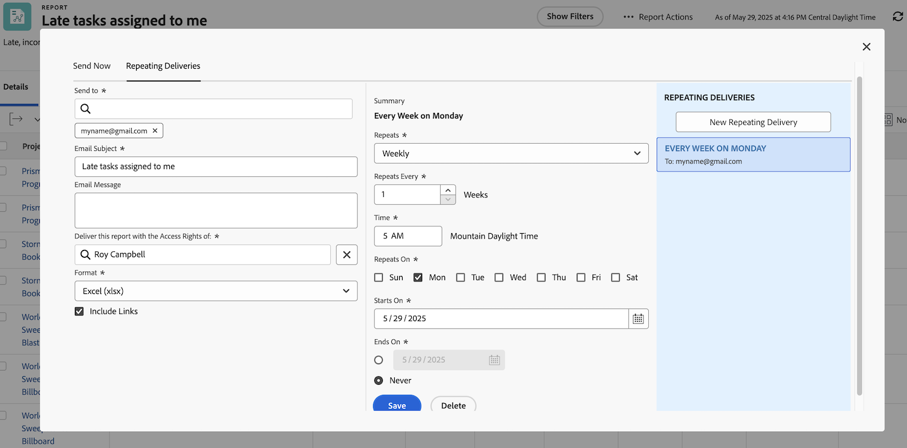

# Send and share reports effectively

In this video, you will learn:

* How to send reports to users, teams, or any email address
* How to share reports with anyone
* What recipients can see and do with a Workfront report

>[!VIDEO](https://video.tv.adobe.com/v/335158/?quality=12&learn=on&enablevpops=0)

## Key takeaways

* **Sending Reports to External Users:** You can send reports to non-Workfront users by entering their email addresses, making it easy to share data outside your organization. ​
* **Access Rights Control Visibility:** The recipient's view of the report depends on the access rights you set, ensuring data security and appropriate visibility. ​
* **Repeating Delivery for Snapshots:** Scheduled deliveries provide frozen snapshots of data at specific times, useful for tracking trends and maintaining a history of project data. ​
* **Sharing Reports with Teams:** Reports can be shared with individuals, teams, or job roles, granting either view or manage rights. ​ Shared reports appear in the users "Shared with Me" section. ​
* **Public and System-Wide Sharing:** Reports can be shared via public links for external users or made visible system-wide for all Workfront users, offering flexibility in data sharing.

## "Send and share reports" activities

### Activity 1: Send a report

Send a report to yourself every Monday at 5 am as an Excel spreadsheet. This is a great way to automatically collect weekly reports that you can later use to see trends.

### Answer 1

1. View any report you have created, and choose **[!UICONTROL Send Report]** from the **[!UICONTROL Report Actions]** menu.
1. Click the **[!UICONTROL Repeating Deliveries]** tab.
1. Put your email address in the **[!UICONTROL Send to]** field.
1. Provide an email subject.
1. Change the format to Excel.
1. Set **[!UICONTROL Repeats]** to [!UICONTROL Weekly].
1. Set the [!UICONTROL Time] to 5 am.
1. Set [!UICONTROL Repeats On] to Monday.
1. Click **[!UICONTROL Save]**.

>[!NOTE]
>
>Notice your new Repeating Delivery in the [!UICONTROL Repeating Deliveries] panel on the right. You can set up multiple deliveries for a report and they all appear here.

**DELETE A DELIVERY**

Select the delivery you just created and click Delete (next to the **[!UICONTROL Save]** button).
