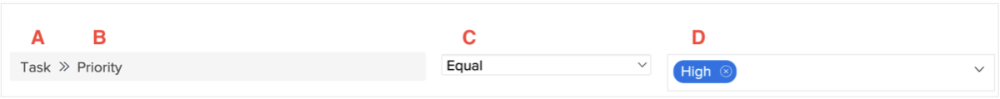

# Explore reporting components in Workfront

The video explains the concept of reporting components in Workfront, which are essential for creating filters, views, and groupings. The key components include:

* **Object Type:** Specifies the Workfront object being dealt with, such as a project, task, or hour entry. ​ Filters, views, and groupings are specific to the object type. ​
* **Field Source and Field Name:** The field source is the item in Workfront where information is attached, and the field name is the specific piece of information (e.g., "description" for a project). ​
* **Value Field:** Represents the content of a field, such as "low," "normal," "high," or "urgent" for the priority field. ​
* **Filter Qualifier:** Defines which values to include or exclude in a report, such as showing tasks with a priority of "high." ​

>[!VIDEO](https://video.tv.adobe.com/v/335146/?quality=12&learn=on&enablevpops=0)

## Key takeaways

* **Reporting Components:** Workfront's reporting components include object type, field source, field name, filter qualifiers, and value field, which are essential for creating filters, views, and groupings. ​
* **Object Type Specificity:** Filters, views, and groupings are tied to specific object types, such as projects, tasks, or hour entries, ensuring reports are tailored to the relevant data. ​
* **Filter Rules:** Filters use field source, field name, qualifiers, and values to define criteria. ​ For example, the "My Projects" filter shows only current projects where the logged-in user is part of the project team. ​
* **Views and Groupings:** Views display field source and field name combinations in columns (e.g., "owner name"), while groupings organize data based on specific criteria (e.g., "company name"). ​
* **Wildcard Usage:** Wildcards in filters allow dynamic matching, such as identifying logged-in users within a project team, enhancing personalization in reporting. ​

## Reporting components quick reference

**A - Field source**

Field source options are dependent on the object type selected. Often, the field source is the item in Workfront that a specific piece of information (aka the field name) belongs to. Sometimes the field source is the same as the object type.
The field source determines what fields names are available.

Examples: [!UICONTROL Project], [!UICONTROL Task], [!UICONTROL Issue], [!UICONTROL Assigned To]

**B - Field name**

Field names are pieces of information available on what you selected as the field source.

They can be Workfront fields you filled in, fields from a custom form, or information that Workfront automatically captures.

Field names drive the value field options.

Examples: [!UICONTROL Progress Status], [!UICONTROL Description], [!UICONTROL Planned Completion Date], Custom form fields

**C - Filter qualifiers**

Filter qualifiers help narrow down the possible results viewable under the field source and field name selected.

They specify how the field source and field name relate to the value field.

Examples: Equal, Contains, Null, Less than

**D - Value**

The value is the piece of information that's entered in the field specified by the field name.

Options for value are determined by the field source and field name.

Wildcards for users and dates can be used in the value, as well as free form text.

Examples: New, Current, $$TODAYbw, Description

>[!TIP]
>
>For help understanding specific field names in Workfront, look in the [Glossary of Adobe Workfront terminology](https://experienceleague.adobe.com/docs/workfront/using/basics/workfront-terminology-glossary.html?lang=en).

