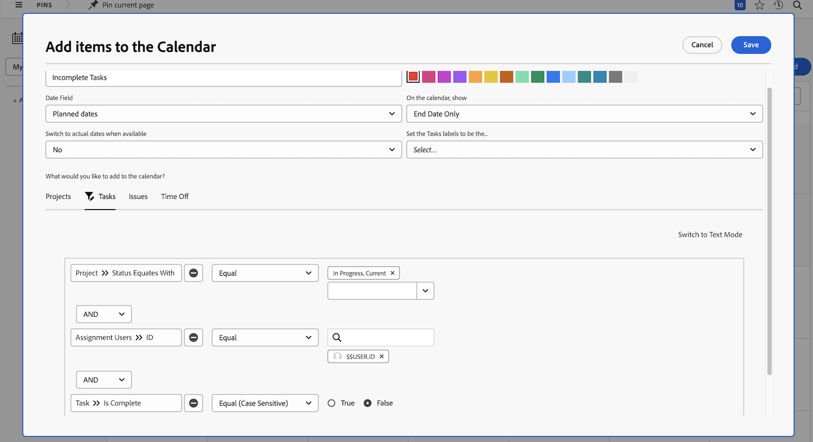
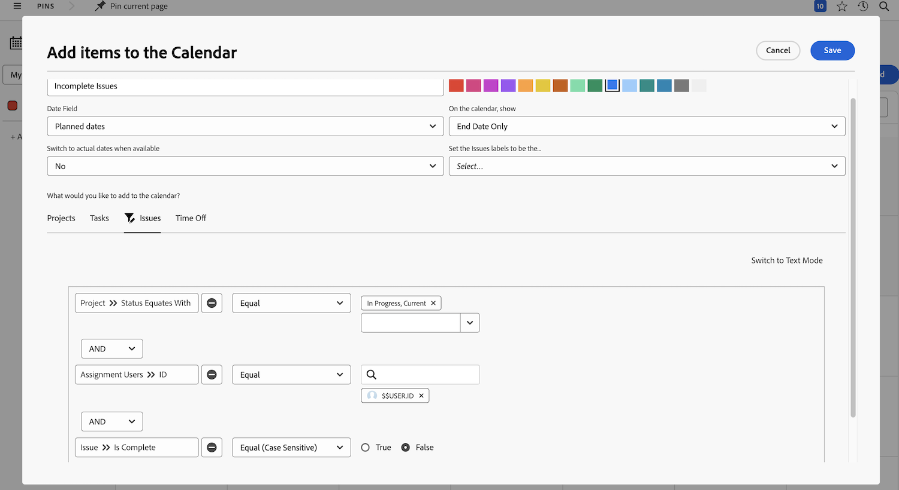

# Your turn to create a calendar report

In this activity you will get hands on experience creating your own calendar.

## Activity: Create a calendar

Create a customer calendar named "My Incomplete Work".

Include a calendar group named "Incomplete Tasks" showing all incomplete tasks assigned to you on Current projects.

Select red as the color for these items.

Include another calendar group named "Incomplete Issues" showing all incomplete issues assigned to you on Current projects. Select blue as the color for these items. 

## Answer

1. Navigate to the Calendars area from the Main menu.
1. Click the New Calendar button and Name the calendar "My Incomplete Work."
1. Click the Add to Calendar button, then Add advanced items.
1. In the Add items to the calendar window that pops up, name the group "Incomplete Tasks."
1. Select red as the color.
1. Change the Date Field to Planned Dates.
1. Set the On the calendar, show field to End Date Only.
1. Set the Switch to actual dates when available field to No.
1. In the What would you like to add to the calendar? section, select Tasks. Then click the Add Tasks button.
1. Add three filter rules:

   * Project > Status Equates With > Equal > Current
   * Assignment Users > ID > Equal > $$USER.ID
   * Task > Is Complete > Equal > False

1. Click Save.

   

1. Create a second grouping by clicking Add to Calendar, then Add advanced items.
1. In the Add items to the calendar window that pops up, name the group "Incomplete Issues."
1. Select blue as the color.
1. Change the Date Field to Planned Dates.
1. Set the On the calendar, show field to End Date Only.
1. Set the Switch to actual dates when available field to No.
1. In the What would you like to add to the calendar? section, select Issues. Then click the Add Issues button.
1. Add the following three filter rules:

   * Project > Status Equates With > Equal > Current
   * Assignment Users > ID > Equal > $$USER.ID
   * Issue > Is Complete > Equal > False

1. Click Save.

   

Because you used $$USER.ID in the filters, you can share this calendar with others and they will see their own incomplete tasks and issues.
