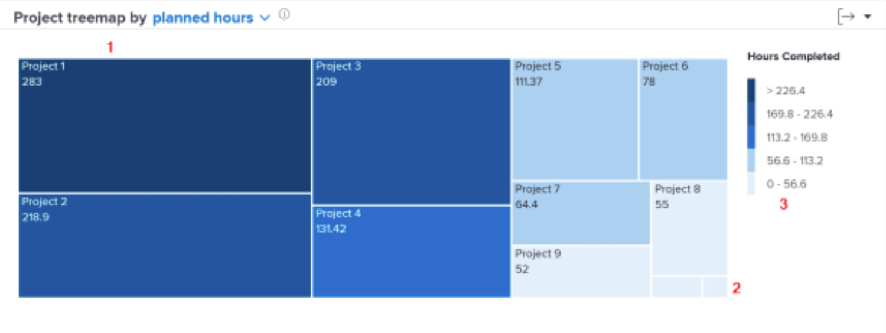

# Dig deeper into navigation

In this video, you will learn:

* How to quickly see how much time workers are dedicating to each project

>[!VIDEO](https://video.tv.adobe.com/v/335050/?quality=12&learn=on&enablevpops=1)

## Review time spent on projects

The Project treemap allows you to understand how much time users have dedicated to a project. Boxes represent projects. The size of the box shows how much time was spent on the project compared to other projects. The larger the box, the more time spent.

Seeing this information helps you determine:

* The priority of things being worked on during the selected date range.
* What users are spending time on.
* If users are focusing on the right things.
* How much the scope of a project changed over that time period when a specific project is selected.

On the chart, you can see:

1. Projects in the filtered time that have more hours completed are represented by larger boxes and a dark blue color.
1. Projects in the filtered time that have less hours completed are represented by smaller boxes and a light blue color.
1. The legend to the right of the chart shows the range of completed hours for each shade of blue.
