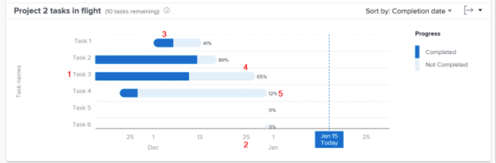

# Review the tasks in flight

In this video, you will learn:

* How to access the Tasks in flight chart
* How to quickly see which tasks have not been completed in a project

>[!VIDEO](https://video.tv.adobe.com/v/335052/?quality=12&learn=on&enablevpops=1)

## Task-level data

The Tasks in flight chart allows you to drill into a specific project's tasks to see the amount of work completed for each active task and how on schedule the tasks are. The chart allows you to understand what tasks in a project need to be completed and what the percentage of completion is for these tasks.

This information can help you determine:

* What people are working on.
* Which tasks could be putting a project at risk.
* How close a task is to completion.
* Who you need to talk to about a specific task.

On the chart, you can see:

1. Task names on the left.
1. Dates across the bottom.
1. The dark blue color within a task bar indicates the amount of work completed for a task.
1. The light blue color within a task bar indicates the amount of work that needs to be completed for a task.
1. The number on the right side of a task bar shows the task's percentage of completion.
