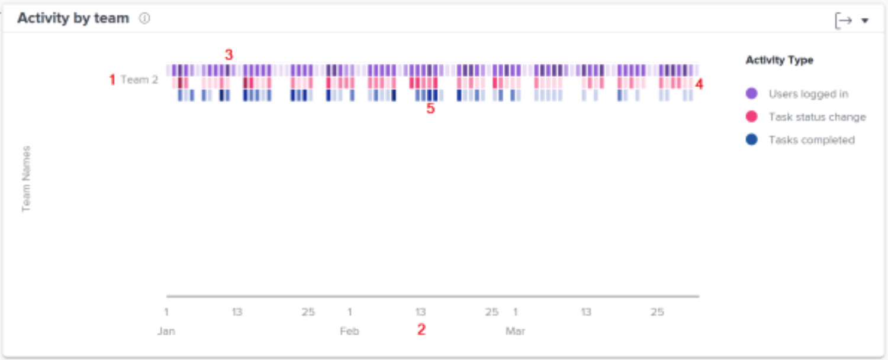

# Understand work and people charts

Work charts show you activity from the project and task perspective, while the People chart shows you activity from the perspective of a home team.

Select the type of Analytics charts you want to view—Work or People—from the left panel menu.

## Work charts

![An image of finding the [!UICONTROL Analytics] feature in the [!DNL Workfront Classic]](assets/section-1-1.png)

When you go to the Work charts, you'll see by default: 

1. KPI statistics
1. Flight plan
1. Project activity
1. Project treemap (not shown above)

The Burndown and the Tasks in flight charts appear when you drill down into the data. 

* Click on a project in the Flight plan view and a Burndown view of that project will appear below it. 
* Click on a project in the Treemap view and both a Burndown and a Tasks in flight view will appear below it.

## People chart - Activity by team

On the chart, you can see:

1. Home team names on the left.
1. Dates across the bottom come from the selected date range.
1. Purple boxes show that users assigned to the project logged in on that day, with a darker shade indicating a higher number of users logging in.
1. Pink boxes show that users changed the status of a task for the project on that day, with a darker shade indicating a higher number of task statuses changing.
1. Blue boxes show that users completed a task for the project, with a darker shade indicating a higher number of tasks being completed.

